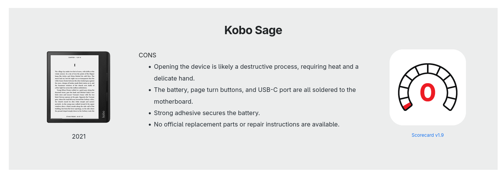
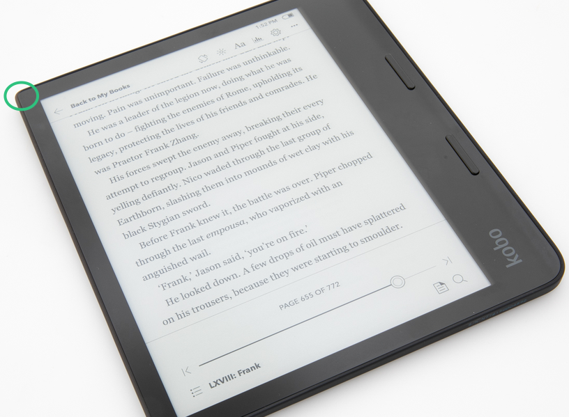
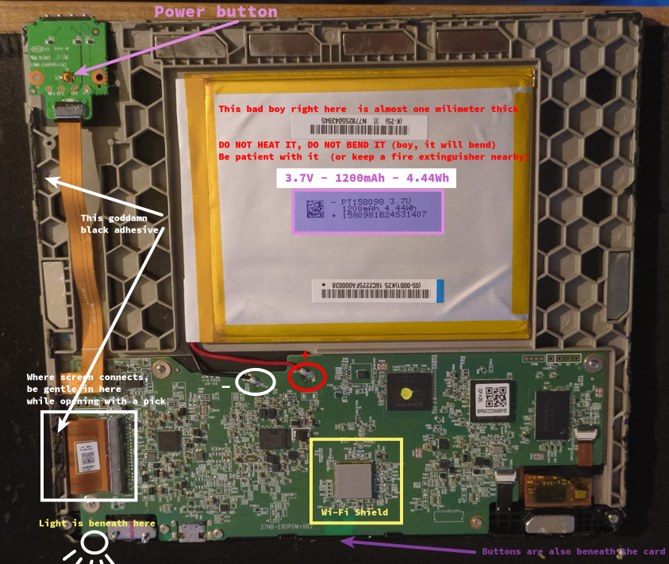
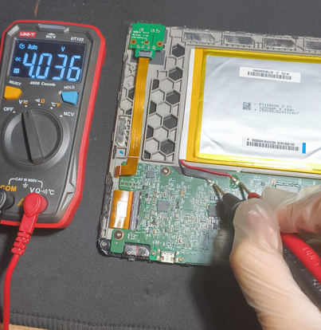
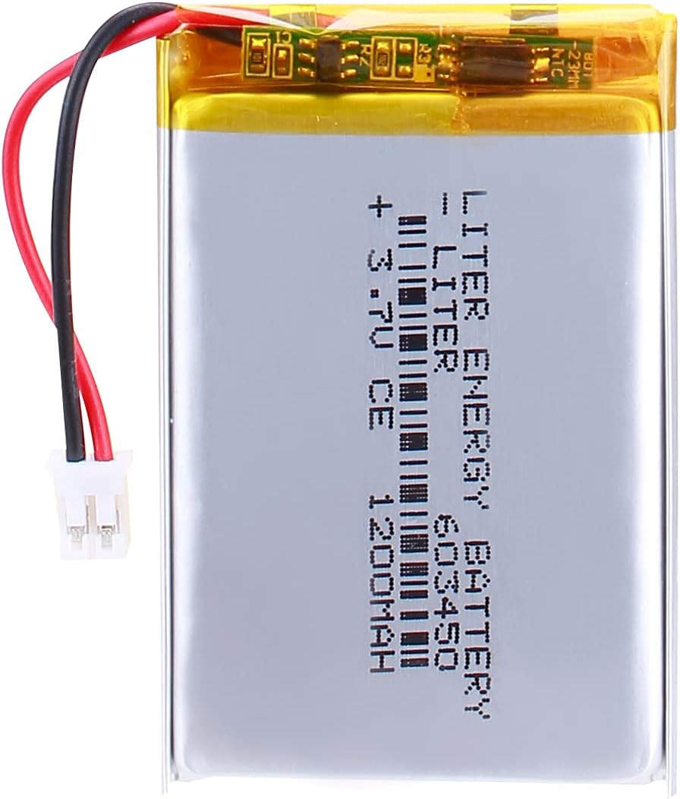


**⚠️ WARNING:** If you do not know what you are doing, do not trust yourself to be delicate enough, do not have the proper tools, if the device is too important to you; please do not try this!

Go see a friendly neighborhood repair shop and seek advice from an actual professional! 


---

I have owned a Kobo Sage e-book reader since 2024. In June 2026, just days after its warranty expired, it decided to stop working. I was quite upset considering its potential and, obviously, the cost of buying a new one in this economy. It had suffered no fall damage, wasn't exposed to harsh conditions, excessive heat, moisture, or any liquids whatsoever. I DID NOT EVEN USE IT AS MUCH AS I WANTED TO. What a waste of potential.

Look, my man here has a zero repairability score on iFixit. What am I supposed to do? Trash it when the lights go out? What do I do with this Stylus 2 Pen that doesn't work anywhere else, do I stick it in my eye next?

I looked up forums to see if anyone had managed to repair it. Almost every comment I saw was "Nevermind, buy a new one," "Getting it fixed costs more than a new one," or "I will switch to Kindle," and so on. Well, this damn device is TOO EXPENSIVE in my country. I was either going to fix it for a reasonable price, or trash it, never buy an e-reader again, and go to an eye doctor to treat my eyes melting from reading PDFs on LCD screens. I didn't want my money to go to waste and regret buying it in the first place, so I forcefully chose the first option.

The problem was this: it worked perfectly fine when plugged into a charger or a computer, but it froze and crashed immediately when switched to battery power. To give a little background, I didn't use or charge it very frequently. Sometimes I would let it sit on the charger for a couple of extra hours (always using quality USB-C cables, I must add).

The thing about Li-ion batteries is that they do not like how I treat them. Whether you leave them fully charged or completely drained, they tend to die inside. Since I had only used the device for about 98 hours total over two years, the probability of the Li-ion battery being dead was pretty high.

Yet, there were a few other possibilities to consider:
1. The Li-ion battery was dead.
2. If it managed battery power somewhat okay but crashed only on certain books, corrupted files might be failing to process.
3. The motherboard's PMIC (Power Management IC) was triggering an Under-Voltage Lockout (UVLO) -> verifying this usually requires a power supply and an oscilloscope.
## How did I open it 

You know how everyone gloats about IPX protection and how great it is? In reality, it is just a black, sticky, and stubborn goo. It is in every modern device and I couldn't hate it more. In the Kobo Sage's case, it has an IPX8 rating, which means:

> "Represents the device's waterproofing capabilities. IPX8 signifies the highest level of protection against water, suitable for continuous submersion under conditions specified by the manufacturer."

I found that the top left corner (marked below) was the easiest to open when I applied a little force with my fingers (not nails—do not stick your nails between the screen and the cover). If you use a tight case with your e-reader, there is always one corner that takes more pressure than the others when you remove it. Without exaggerating, apply a bit of force to the thin corners and see if they yield a little space.

I do not recommend starting from the more rounded corners on the button side. Specifically, on the top-right, there is a screen connector and even more sticky adhesive above it. Also, **please do not take the chance of sticking anything sharp into the top-right corner; do not risk tearing that screen connector.** (Fixing and soldering a torn ribbon cable is extremely difficult and requires too much attention, patience, time, and specialized equipment).

I did not apply any heat during the opening process. Without prior knowledge of the internal component placement, and considering the back cover plastic appeared highly susceptible to thermal deformation, using a heat gun did not seem like a viable approach. I managed to pry it open without thermal assistance; however, if you are proficient with a heat gun and trust your thermal management after analyzing the internal layout provided later in this documentation, you may proceed with heat application at your own discretion.

After getting a small opening in one corner, you will need a prying tool that is **flexible**, **blunt**, and **thin**. I used a couple of plastic picks. The adhesive goo is not on the vertical sides; it is attached where the back cover meets the internal chassis, parallel to the surface.

Keeping this in mind, you have to use very gentle prying force and a lot of patience.

If you manage to get the back cover off without any serious damage, you will notice the power button has a separate PCB. It connects to the motherboard via a long ribbon cable and is attached to the back cover by two small screws. Removing and reinstalling them can be tricky given the tight space, but it is doable.

## What it looks like on the inside

At first glance, after all that effort, a couple of things are worth noticing:

- The battery cables are directly soldered to the motherboard, and the solder points have a small transparent protector over them.

- It’s no wonder the power button felt weird before; it looks even more ridiculous when you see the actual switch mechanism they opted for.

- The battery takes up a lot of space, but don't be fooled by its footprint; it is EXTREMELY THIN. If you want a perfect OEM-style solution, you can try to buy a battery with the exact dimensions (which will be very hard to find, mind you). But if you are just repairing it for functionality, there are other batteries that, while not a perfect fit size-wise, won't prevent the back cover from closing properly.

- If you are having issues with the page-turn buttons, you will have to remove the motherboard by taking out six more screws to check behind it.

Here is a sneak peek of the internals. Take a look at the image below.

##  Measurements

I scraped off a little of the protective glue on the battery solder points to get a decent reading and placed my multimeter probes. While the device was frozen or just sitting idle, I measured 4V. However, when I pressed the power button while monitoring the values, the voltage suddenly dropped to 3.4-3.5V. This voltage sag was the reason the PMIC kept locking out my device; it was registering values below the expected operating voltage under load.

## The Fix

Any 3.7V Li-ion battery with 1200mAh (4.44 / 3.7 = 1.2Ah) that is thin enough will get the job done. It doesn't have to fit perfectly; the back cover is plastic and can flex slightly, so it will close just fine even if the battery isn't an exact match in size.

Keep in mind that most aftermarket batteries come with a standard JST connector. The Kobo Sage motherboard does not have a connector socket; the power lines are directly soldered. You cannot just plug it in. You will need to remove this connector and solder the wires yourself.

**CRITICAL WARNING:** When removing the JST connector, cut the wires ONE BY ONE. If your wire cutters slice through both the red (VCC) and black (GND) wires simultaneously, you will short the battery and create a fire hazard.

## The Cost

I originally purchased this device two years ago for roughly $246. Today, the current market price for the exact same unit has escalated to an absurd $565. On top of that, accessories like a proper cover and the Stylus 2 add another $109 to your total ecosystem cost.

I contacted an authorized service center to get a baseline repair quote. They demanded $100 for the fix. This requested amount was more than a third of my initial purchase price for the entire device. Since buying a brand new one (only to not read pdfs I saw here and there) was already out of the question, accepting this service quote was mathematically and logically unacceptable to me.

**Ultimately, disregarding the time and effort spent on the hardware, I just sourced a replacement battery for $10 (450 TRY). The absolute financial cost of this entire repair operation was exactly $10.**

Odds were on my side for this one (yay!), hopefully see you on the next repair. 

---

A final note: if you end up with an irreparable device but the E-INK screen is still healthy, please do not throw it away. E-INK panels are incredibly expensive, especially at these sizes. If you cannot repair what you have, I strongly encourage you to salvage its usable parts properly.