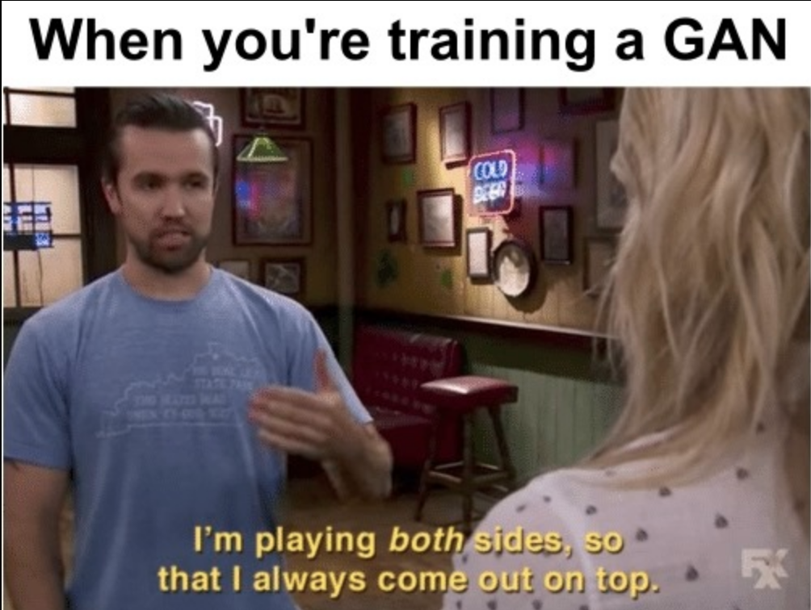
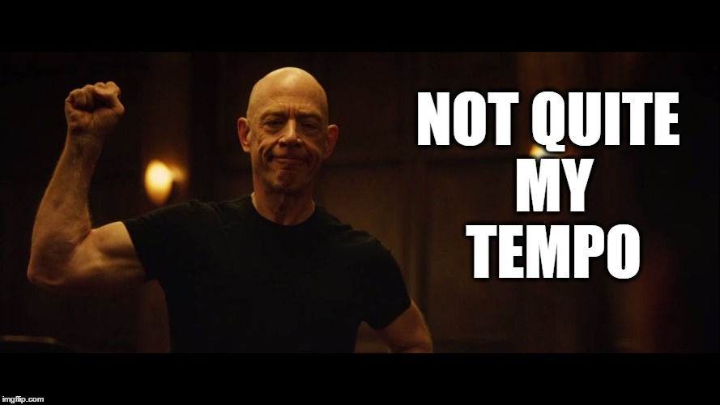
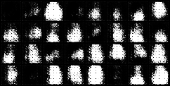
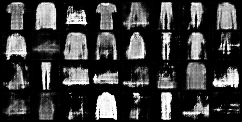
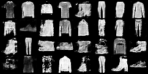
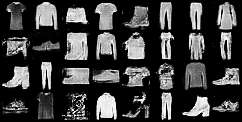
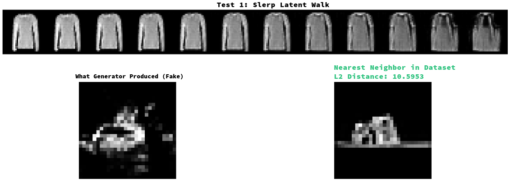

## 1. Chosen Topic and Architecture

### 1.1. Overview on Generative Adversarial Networks

Generative Adversarial Networks, GANs, are two different models trying to improve together and they depend each other for achieving a task. It has two main parts, one being the Generative part, which is the creator side of the model and the Discriminator part which constanly criticizes (mathematically penalizes) Generative part's outputs to make those outputs closer to the assigned task. So far so good.

It is a zero-sum game that these models play, if Generative part creates a good and close output the Discriminator levels itself to be able to critisize good outputs to make them excellent. Means punishment to Discriminator. If Generative part generates a bad output, Discriminator punishes the Generator and wins the round. What I explained by this paragraph is simplest version of **Nash Equilibrium** from game theory. Yet it is best to underline that this is the hardest concept to achieve for these two models. Which is denoted as follows:


\min_{G} \max_{D} V(D, G) = \mathbb{E}_{x \sim p_{\text{data}}(x)}[\log D(x)] + \mathbb{E}_{z \sim p_{z}(z)}[\log(1 - D(G(z)))]


In this context, the Nash Equilibrium $(D^*, G^*)$ is the state where neither player can decrease their own loss further by changing their strategy unilaterally. Mathematically, it satisfies:


V(G^*, D) \leq V(G^*, D^*) \leq V(G, D^*)


To explain why I have chosen this subject, I could simply say it is for the sake of competitiveness within the GAN concept. Solving a problem by pitting two different models against each other creates a friction that results in more internalizable and assimilable solutions, which can also be observed in real-life situations. This might seem like a vague paragraph for now in this overview, but I plan to demonstrate the real-life considerations that led me to the solutions I suggested for integrated use later on.



### 1.2. Mathematical Basics

#### 1.2.1. Adversarial Minimax Objective

The fundamental objective of a Generative Adversarial Network is defined as a zero-sum game between the Discriminator ($D$) and the Generator ($G$):


\min_{G} \max_{D} V(D, G) = \mathbb{E}_{x \sim p_{\text{data}}(x)}[\log D(x)] + \mathbb{E}_{z \sim p_{z}(z)}[\log(1 - D(G(z)))]


#### 1.2.2. Hinge Loss Formulation

To improve training stability, the Hinge Loss variant is employed for the Discriminator:


L_{D} = \mathbb{E}_{x \sim p_{data}}[\max(0, 1 - D(x))] + \mathbb{E}_{z \sim p_{z}}[\max(0, 1 + D(G(z)))]


### 1.3. Limitations of GANs

#### 1.3.1. Vanishing Gradients

The vanishing gradient problem is almost everywhere. More than that, it is the most critical issue for anyone training a model. If backpropagation fails at a certain point, the rest of the epochs become useless because losses simply go to NaN. The model gets paralyzed. I realized that almost every solution we try is actually an effort to stop these gradients from vanishing. That is why I wanted to implement a capping solution—which I will explain in "Our Approach for the Limitations"—before all the computations and effort go to waste. I know this is not just a GAN issue, but it is a major pain point in GAN stability as well.

#### 1.3.2. Mode Collapse

Aside from vanishing gradients, I can clearly point out that mode collapse is more of a GAN specific problem. If I had to simply put it, our Generator throws itself in front of the Discriminator just to be liked and less penalized by it, at the cost of not learning the actual task it should learn. So generator is stuck with similar, almost same, outputs the Discriminator likes (mathematically of course). In the meantime, Discriminator does not see anything new, and as anyone who is constanly pleased, chasing it's own tail and does not see and get surprised by anything new. Therefore they are stuck with each other. Since one cannot progress, other does not move forward. Obviously, this not an optimal situation.

As far as I have checked, there are two text-book solutions to combat this. One would be the **Wasserstein Loss** (which is also being used as vanishing gradients problem's solution) and the other is **Unrolled GANs**.

* **Wasserstein Loss:** By utilizing the Earth Mover's Distance (what a name to adress a technique!), it releases the Discriminator from the burden of being the king of a small hill (local minima). This way, it is constantly displeased and seeking better, more diverse outputs.
* **Unrolled GANs:** It tries to predict what the Discriminator won't like in the next iterations to avoid foreseeable penalties from the Generator's perspective. Therefore, the Generator does not only combat the current "visionless" Discriminator, it also tries to avoid whom the Discriminator might become in the next updates.

#### 1.3.3. Failure to Converge

Due to the nature of the zero-sum game, if one party progresses much faster than the other, it prevents convergence and leads to instability. This problem can be analyzed from two perspectives:

* **Generator dominance:** If the Generator becomes significantly better, the Discriminator fails to provide any meaningful criticism. It becomes unable to distinguish between real and fake, eventually getting completely lost. Since it can no longer make a reasoned decision, it essentially "flips a coin" with a 50% chance of being right, which ironically becomes a better strategy than attempting a verdict with even less success.
* **Discriminator dominance:** If the Discriminator becomes much more powerful than the Generator, the Generator gets penalized for every single attempt. This overwhelming feedback leads the Generator to produce completely out-of-place outputs—"complete trash," one might say—as it fails to find any gradient path to improvement.



## 2. Proposal

Before diving into techniques and trade-offs, I want to limit this project's scope. In the following chapters, I will try to find solutions to the following major problems through different smaller improvements:

* Mode Collapse
* Concept Drift
* Failure to Converge
* Manifold Drift (Related to chosen dataset)

I have examined these problems by imagining and transforming them into real-life analogies. The first point I thought could be improved was the limitation of only learning from model outputs.  What if these two models tried to profile each other? Beyond knowing themselves, they would also know the adversary. Meaning, what if the Generator could understand what the Discriminator expects and rejects—not only from a single response at each step, but from the context of previous reactions? Conversely, what if the Discriminator could profile the Generator to analyze its tendencies and recurring feature failures? This analogy led me to think about **Failure Buffers** and **Contrastive Loss**. Instead of just taking lessons from isolated penalties and successes, the model could learn from cumulative rewards and penalties.

Second, I have thought of these two models in a debate. At each new argument, opposing parties often stray from the actual point while trying to attack small details their opponent throws into the conversation. Eventually, if a mediator does not point the parties back to the actual subject, the objective is lost. I imagined a mediator that would take action if the losses and learning rates of the Generative and Discriminative models became imbalanced. But throwing a new model at everything would triple the current problems—after all, who watches the watchmen? This path led me to thinking of a more specialized Discriminator that would ask itself two questions:

* Is it fake or real?
* What is the rotation of the data? (image)

Ultimately, I wanted a simple solution and found **rotation prediction in self-supervised GANs**.

As an addition to the debate example, I still needed a checkpoint mechanism that would return to a critical point before the topic is lost. While searching for ways to implement this, I have came across the **Momentum Encoder**.

### 2.1. My Approach for the Limitations

I can map the proposed mechanisms to the specific problems they aim to solve as follows:

* **Mode Collapse vs. Failure Buffer & Contrastive Loss:** To prevent the Generator from taking the "easy way out" by repeatedly producing the same samples, we remind it of its past failures. By using a Contrastive Loss, the model doesn't just react to the current feedback; it actively tries to stay away from the "unwanted list" in the Failure Buffer. Essentially, the Generator learns to say, "I've tried this before, and it didn't work."
* **Concept Drift vs. Momentum Encoder (EMA):** Just like in my debate analogy, we need a point of reference so the conversation doesn't drift away. The Momentum Encoder ($D_{EMA}$) prevents the Discriminator from changing too rapidly and confusing the Generator. It acts as the "voice of reason," providing the Generator with a consistent and long-term target to aim for.
* **Failure to Converge vs. Dynamic Lambda (Mediator):** I established a "Mediator" mechanism that monitors who is dominating the game. If the Generator starts producing "trash" because it's being penalized too harshly (imbalanced loss ratios), the Mediator intervenes by dynamically adjusting the penalty weights ($\lambda$). This ensures a balanced competition without falling into the "impossible critique" trap.
* **Manifold Drift vs. Self-Supervised Rotation Head:** To ensure the Generator truly understands what it is creating—especially for Fashion MNIST dataset—we don't just ask the Discriminator if an image is "real or fake." We also want make it predict the rotation of the object. This extra task forces both models to comprehend the underlying geometry and logic of the data, preventing them from drifting outside the actual manifold. Obviously for different datasets, rotation head technique might require a change.

### 2.2. Mathematical Bases for the Hypothesis

#### 2.2.1. Self-Supervised Rotation Constraint

The Discriminator is tasked with predicting the rotation angle applied to images to capture structural features:

$$L_{rot} = - \sum_{i=1}^{4} y_{rot, i} \log(D_{rot}(x_{rot}))$$

where $x_{rot}$ represents the image rotated by $\theta \in \{0^\circ, 90^\circ, 180^\circ, 270^\circ\}$.

#### 2.2.2. Momentum Encoder (DEMA) Update

To maintain a stable reference manifold for contrastive calculations, the Exponential Moving Average (EMA) update is defined as:

$$\theta_{DEMA} \leftarrow \alpha \theta_{DEMA} + (1 - \alpha) \theta_{D}$$

where $\alpha \in [0, 1]$ is the momentum coefficient (typically 0.999).

#### 2.2.3. Contrastive Failure Repulsion

The repulsion mechanism utilizes Cosine Similarity to measure the proximity between current features and the failure buffer:

$$S_c(f_{curr}, f_{fail}) = \frac{f_{curr} \cdot f_{fail}}{\Vert{}f_{curr}\Vert{} \Vert{}f_{fail}\Vert{}}$$

The contrastive penalty applied to the Generator is then:

$$L_c = \max(0, S_c(f_{curr}, f_{fail}) - m)$$

where $m$ denotes the repulsion margin.

## 3. Simulation Phase

### 3.1. The Dataset

I have chosen FashionMNIST dataset for the training, the reason I have chosen this dataset was to see data's transformation in each epoch visually which I will present in the chapter "Interpreting Training Results".

FashionMNIST data is defined by following quote-quote statement in it's source.

> **FashionMNIST Content Explained by Creators**
>
> "Fashion-MNIST is a dataset of Zalando's article images—consisting of a training set of 60,000 examples and a test set of 10,000 examples. Each example is a 28x28 grayscale image, associated with a label from 10 classes."
>
> Each training and test example is assigned to one of the following labels:
> | Label | Description |
> | :---: | :--- |
> | 0 | T-shirt/top |
> | 1 | Trouser |
> | 2 | Pullover |
> | 3 | Dress |
> | 4 | Coat |
> | 5 | Sandal |
> | 6 | Shirt |
> | 7 | Sneaker |
> | 8 | Bag |
> | 9 | Ankle boot |


Here is how it the distances look like in the 3D space. It will be helpful for understanding the nearest neighbor distances in later test results.


### 3.2. Environment

To run the test code and train with 60.000 samples, I have used a Google Colab Pro A100 machine with 40GB VRAM. Since I did not know what to expect and everything is overcomplicated and greedy on resources nowadays, I did not realize how overkill this environment was.

Luckily, model training took at most 0.8GB of GPU VRAM on the A100, and the training phase with 50 epochs took approximately 10 minutes. Therefore, if you do not want to waste your hard-earned computing units unlike me, you might want to downgrade your runtime.

### 3.4. The Failures and Changes

#### 3.4.1. Failure 1: Static Lambda on Contrasive Penalty

Fixed hyperparameters for the Contrastive Loss ($\lambda_c$) caused the Generator to produce "trash" outputs when the Discriminator was too dominant. The Generator couldn't find a balance between fooling the Discriminator and avoiding the Failure Buffer.

Since the Generator could not fill its failure buffer (values stayed below the Hinge Loss threshold), the "Mediator" was unable to interfere and balance the competition with additional penalties.


```
Epoch [1/50] | D_Loss: 0.1876 | G_Loss: -3.1415 | Contrastive Penalty: 0.0000
Epoch [2/50] | D_Loss: 0.1138 | G_Loss: -3.0842 | Contrastive Penalty: 0.0000
Epoch [3/50] | D_Loss: 0.0916 | G_Loss: -3.0999 | Contrastive Penalty: 0.0000
Epoch [4/50] | D_Loss: 0.0921 | G_Loss: -3.1120 | Contrastive Penalty: 0.0000
Epoch [5/50] | D_Loss: 0.0753 | G_Loss: -3.4223 | Contrastive Penalty: 0.0000
Epoch [6/50] | D_Loss: 0.0513 | G_Loss: -3.3827 | Contrastive Penalty: 0.0000
Epoch [7/50] | D_Loss: 0.0683 | G_Loss: -8.0768 | Contrastive Penalty: 0.0000
Epoch [8/50] | D_Loss: 0.0680 | G_Loss: -8.0331 | Contrastive Penalty: 0.0000
Epoch [9/50] | D_Loss: 0.0398 | G_Loss: -5.7941 | Contrastive Penalty: 0.0000
Epoch [10/50] | D_Loss: 0.0599 | G_Loss: -6.2807 | Contrastive Penalty: 0.0000 
```

So I switched to dynamic ratio-based weighting system. By monitoring the loss ratio between $G$ and $D$, the code now automatically scales the contrastive penalty. If the Generator starts to fail significantly, the "Mediator" adjusts the weights to give the Generator room to recover.

#### 3.4.2. Failure 2: Vanishing Gradients in Standard Minimax

The original GAN loss led to "saturation," where the Discriminator became too confident, providing zero-utility gradients to the Generator. This effectively paralyzed the learning process.

**HotFix:** I implemented `torch.amp.GradScaler` for automatic mixed precision (AMP) and enabled `TF32 (TensorFloat-32)` on the A100. This prevented numerical instability and utilized specialized Tensor Cores to maintain meaningful gradient flow during backpropagation.

#### 3.4.3. Failure 3: Dysfunctional Gradient Flow with Standard ReLU

In the early iterations of the architecture, I have utilized the standard ReLU activation function. However, I observed that it was unable to handle the negative loss values effectively. When the input to a ReLU unit becomes negative, the neuron stays "inactive" and outputs zero, leading to the "Dead ReLU" problem. In the adversarial setup, this caused a significant portion of the network to stop updating, effectively paralyzing the learning process for the Generator.

**HotFix:** To maintain a consistent gradient flow even for negative values, I replaced all ReLU activations with _Leaky ReLU_ (with a slope of 0.2). This ensures that even when a neuron is not "active," it still passes a small gradient back through the network. This change was crucial for the stability of the S2C2-GAN, as it allowed the model to recover from the high-penalty states recorded in Failure Buffer.

### 3.5. Interpreting Training Results

```
Epoch [1/50] | D_Loss: 1.2462 | G_Loss: 0.6080 | Contrastive Penalty: 0.0000
Epoch [2/50] | D_Loss: 2.2803 | G_Loss: 2.6123 | Contrastive Penalty: 0.0000
Epoch [3/50] | D_Loss: 1.5059 | G_Loss: 1.8720 | Contrastive Penalty: 0.0031
Epoch [4/50] | D_Loss: 1.3327 | G_Loss: 1.2659 | Contrastive Penalty: 0.0110
Epoch [5/50] | D_Loss: 1.3500 | G_Loss: 0.0869 | Contrastive Penalty: 0.0398
Epoch [6/50] | D_Loss: 1.2861 | G_Loss: 0.5479 | Contrastive Penalty: 0.0641
Epoch [7/50] | D_Loss: 1.5568 | G_Loss: 1.6640 | Contrastive Penalty: 0.0808
Epoch [8/50] | D_Loss: 1.1681 | G_Loss: 1.0908 | Contrastive Penalty: 0.1134
Epoch [9/50] | D_Loss: 1.1891 | G_Loss: 1.2575 | Contrastive Penalty: 0.1099
Epoch [10/50] | D_Loss: 1.1862 | G_Loss: 1.9712 | Contrastive Penalty: 0.1550
Epoch [11/50] | D_Loss: 1.2010 | G_Loss: 1.4648 | Contrastive Penalty: 0.1526
Epoch [12/50] | D_Loss: 1.0994 | G_Loss: -0.1114 | Contrastive Penalty: 0.1572
Epoch [13/50] | D_Loss: 1.2313 | G_Loss: 2.4109 | Contrastive Penalty: 0.1382
Epoch [14/50] | D_Loss: 1.1831 | G_Loss: 2.2679 | Contrastive Penalty: 0.1393
Epoch [15/50] | D_Loss: 1.1155 | G_Loss: 0.9712 | Contrastive Penalty: 0.1443
Epoch [16/50] | D_Loss: 1.2494 | G_Loss: 1.4637 | Contrastive Penalty: 0.1179
Epoch [17/50] | D_Loss: 0.7824 | G_Loss: 1.4360 | Contrastive Penalty: 0.1156
Epoch [18/50] | D_Loss: 1.1092 | G_Loss: 1.9319 | Contrastive Penalty: 0.1094
Epoch [19/50] | D_Loss: 1.1813 | G_Loss: 1.2117 | Contrastive Penalty: 0.0936
Epoch [20/50] | D_Loss: 1.3186 | G_Loss: 1.7993 | Contrastive Penalty: 0.0878
Epoch [21/50] | D_Loss: 1.1528 | G_Loss: 1.6114 | Contrastive Penalty: 0.0934
Epoch [22/50] | D_Loss: 1.0929 | G_Loss: 0.8893 | Contrastive Penalty: 0.0831
Epoch [23/50] | D_Loss: 0.9827 | G_Loss: 1.8305 | Contrastive Penalty: 0.0715
Epoch [24/50] | D_Loss: 1.1067 | G_Loss: 1.4263 | Contrastive Penalty: 0.0612
Epoch [25/50] | D_Loss: 1.3256 | G_Loss: 1.8672 | Contrastive Penalty: 0.0586
Epoch [26/50] | D_Loss: 1.0456 | G_Loss: 0.7815 | Contrastive Penalty: 0.0553
Epoch [27/50] | D_Loss: 1.1642 | G_Loss: 1.0039 | Contrastive Penalty: 0.0586
Epoch [28/50] | D_Loss: 1.3552 | G_Loss: 1.7973 | Contrastive Penalty: 0.0425
Epoch [29/50] | D_Loss: 1.5992 | G_Loss: 0.3180 | Contrastive Penalty: 0.0456
Epoch [30/50] | D_Loss: 1.3865 | G_Loss: -0.0608 | Contrastive Penalty: 0.0373
Epoch [31/50] | D_Loss: 1.1239 | G_Loss: 0.3891 | Contrastive Penalty: 0.0399
Epoch [32/50] | D_Loss: 1.0721 | G_Loss: 1.1706 | Contrastive Penalty: 0.0404
Epoch [33/50] | D_Loss: 1.2070 | G_Loss: 0.1284 | Contrastive Penalty: 0.0340
Epoch [34/50] | D_Loss: 1.1510 | G_Loss: 0.4091 | Contrastive Penalty: 0.0335
Epoch [35/50] | D_Loss: 1.1771 | G_Loss: 0.4314 | Contrastive Penalty: 0.0291
Epoch [36/50] | D_Loss: 1.2583 | G_Loss: 1.2322 | Contrastive Penalty: 0.0289
Epoch [37/50] | D_Loss: 1.1563 | G_Loss: 1.7793 | Contrastive Penalty: 0.0265
Epoch [38/50] | D_Loss: 1.2008 | G_Loss: 0.2890 | Contrastive Penalty: 0.0297
Epoch [39/50] | D_Loss: 1.4565 | G_Loss: 1.5657 | Contrastive Penalty: 0.0289
Epoch [40/50] | D_Loss: 1.2681 | G_Loss: 1.3631 | Contrastive Penalty: 0.0269
Epoch [41/50] | D_Loss: 0.9863 | G_Loss: 0.4673 | Contrastive Penalty: 0.0231
Epoch [42/50] | D_Loss: 0.9141 | G_Loss: 1.4647 | Contrastive Penalty: 0.0199
Epoch [43/50] | D_Loss: 1.1724 | G_Loss: 1.7640 | Contrastive Penalty: 0.0223
Epoch [44/50] | D_Loss: 1.0424 | G_Loss: 0.6807 | Contrastive Penalty: 0.0207
Epoch [45/50] | D_Loss: 1.1517 | G_Loss: 0.9715 | Contrastive Penalty: 0.0155
Epoch [46/50] | D_Loss: 1.0468 | G_Loss: 0.4148 | Contrastive Penalty: 0.0178
Epoch [47/50] | D_Loss: 1.4713 | G_Loss: 1.9358 | Contrastive Penalty: 0.0184
Epoch [48/50] | D_Loss: 1.0180 | G_Loss: 0.8042 | Contrastive Penalty: 0.0174
Epoch [49/50] | D_Loss: 1.1260 | G_Loss: 1.9410 | Contrastive Penalty: 0.0210
Epoch [50/50] | D_Loss: 1.2244 | G_Loss: 1.6777 | Contrastive Penalty: 0.0169
```

#### 3.5.1. Cold Start in Epoch 1-2

At first Discriminator starts completely clueless and Generator gets a headstart, we can interpret this by looking at losses in Epoch 1. Yet in Epoch 2, both Generator and Discriminator fail miserably compared to first epoch, Generator's headstart from previous step seems to be vanished already. Which is a positive thing in this start to fill and test the failure buffers we implemented. Since these are the meeting rounds and failure buffers are just filling until Hinge Loss treshold, our "Mediator" does not intervene with Contrasive Penalty yet. This is the main reason why contrasive penalty is zero in these epochs.

#### 3.5.2. Crash and Recovery in Epoch 11-12-13

Until Epoch 12, everything is going as planned. Generator learning, Discriminator learning yet we are still not sure if Mediator is helping out as we planned since things are good. First challenge to test the mediator arrives at Epoch 12.

Discriminator is doing fine, got better in each previous epoch in stability. But the Generator suddenly progresses too good in one epoch and got rewarded by taking the loss into negative numbers. Good for it, but it had to get better in the same rate of Discriminator got worse, yet this is not what happened. The Nash Equilibrium got broken in the Epoch 12. Mediator intervenes so hard to keep the balance, Generator takes 2.5223 penalty (2.41090 + (-0.1114)) in one step because it did not gradually got better while waiting for Discriminator.

#### 3.5.3. Contrasive Penalties Between Epoch 8-18

Aside from the incident in Epoch 12, between epoch 8 and 18 we see a good learning phase that is handled by the the Mediator. The reason I have highlighted these earlier steps is because the contrasive penalty between these epochs are the highest. This slice is most likely where the feature extraction happens for the Generator. Not much to dwell on here, moving on with next crisis point.

#### 3.5.4. Mitigating Convergence in Epoch 29-30-31

We reach another critical point after feature extraction at Epoch 29,30 and 31. This is the place Generator got much better at creating images and finished the feature extraction. Discriminator is not doing too bad but it is worse compared to the Generator as we see from the losses. After all these feature extractions are done in Generator's behalf and there is no advanced Discriminator at its level that can criticize the outputs, Generator is expected to go into overfitting state. Contrasive penalties are relatively low, since failure buffers are not filling as much in the earlier learning phase.

Yet as nothing good goes unpunished, we need to remind the Generator the fact that there is always someone else better than it. Therefore I gave it a little anchor by reminding it the good old days it could learn instead of eating itself away with perfectionism via Momentum Encoder.

#### 3.5.5. Reaching Stability in Epoch 49-50

This part is a good scene to look at, feature extractions are left behind, everyone learned what they needed to learn, failure buffers gotten smaller and smaller for each of them therefore contrasive penalties gone near zero again. This is what a good end looks like for this training.

#### 3.5.6. Visualization of the Training

Overall, I wanted to see if my inferences above were true, and I have saved generated photos in each epoch. When I have analyzed the images, seeing I was right was a relief and you can also see the highlights in overall outputs below.

|||
|---|---|
|**Epoch 1: Initial Random Noise**|**Epoch 10: Structural Emergence**|
|||
|**Epoch 25: Feature Stabilization**|**Epoch 50: Final Manifold Convergence**|
|||

_Visual progression of S2C2-GAN across different training stages. The transition from stochastic noise to high-fidelity fashion items demonstrates the efficacy of the Self-Supervised Critique mechanism._

### 3.6. Testing and Benchmarking

To validate the generative quality and generalization capability of the S2C2-GAN, two primary tests were conducted: Spherical Linear Interpolation (Slerp) and Nearest Neighbor distance analysis. The results, visualized in the figure below, provide empirical evidence against mode collapse and memorization.



#### 3.6.1. Spherical Linear Interpolation (Slerp)

To evaluate manifold continuity, Slerp is used to navigate the latent space. In simple terms, it is to check if features are correctly understood by the Generator and see if it skips frames and features, jumping into meaningless conclusions while trying to improve it.

In the Slerp test above, you will see it started with a non detailed blouse, give it small details in each iteration. First it corrected blurred edges, added some shadows for the fabrics folding points and eventually, after doing a pretty good blouse it turned the blouse into some kind of a dress. This showed us that the Generator understood similar features between a blouse and a dress and turned one to another smoothlessly.

Here is how Slerp calculation denoted mathematically:

$$Slerp(z_1, z_2, t) = \frac{\sin((1-t)\theta)}{\sin \theta}z_1 + \frac{\sin(t\theta)}{\sin \theta}z_2$$

#### 3.6.2. Nearest Neighbor Metric (Euclidian Distance)

To detect potential memorization (overfitting), the minimum $L_2$ distance to the training set is calculated. This is the formal definition though, I would like to define this metric as an optic test to see how far the model can see until it can make sense of a showed image. Basically a myopia/hypermetropia test for models.

$$d_{min} = \min_{x_{real} \in \mathcal{D}_{train}} \Vert{} G(z) - x_{real} \Vert{}_2$$

So how do I know we done a good job? Our L2 value is 10.5953. Here is what L2 tresholds meant as I learned:

- $L_2 > 20.0 \implies \text{Failure / Mode Collapse Zone}$
    
- $15.0 < L_2 \leq 20.0 \implies \text{Standard DCGAN Baseline}$
    
- $10.0 < L_2 \leq 15.0 \implies \text{S2C2-GAN Optimal Stability Zone (Current: 10.5953)}$
    
- $5.0 < L_2 \leq 10.0 \implies \text{High Fidelity / Potential Overfitting}$
    
- $L_2 < 5.0 \implies \text{Memorization / Latent Space Collapse}$
    
- $\Delta L_2 \approx 0 \implies \text{Nash Equilibrium Achievement}$
    

### 3.7. Optimization Suggestions and Results

#### 3.7.1. Adaptive Lambda Scaling

The dynamic critique weight $\lambda_{dyn}$ is adjusted based on the relative loss ratio to prevent the Discriminator from overpowering the Generator:

$$\lambda_{dyn} = \lambda_{base} \cdot \min\left(\frac{\vert{}L_G\vert{}}{L_D + \epsilon} \cdot \frac{1}{\tau}, \beta\right)$$

#### 3.7.2. Total Combined Objective

The final objective function for the Generator in the S2C2-GAN architecture is:

$$L_{G, total} = L_{adv} + \lambda_{ss} L_{rot} + \lambda_{dyn} L_c$$

## 4. Problems of The Approach and Future Work

I am aware it is almost never a best practice to throw new features and adding new moving parts to core problems that requires serious trade-offs. That only brings more problems to solve, and creates a need for more optimizations where these "moving parts" interact each other. As Richard Hamming says in Art of Doing Science and Engineering, "If you optimize the components, you will probably ruin the system performance." Overall we maybe improved by later results but every addition came with their optimization issues.

1. Adding rotations will require changes for inputs and outputs other than images. Furthermore, this approach will be obsolete if image rotations do not matter for the specific input/output (e.g., images of a microorganism, parts of a map, etc.).
    
2. Failure buffers and their hinge loss thresholds should be optimized regarding the assignment. Increasing the size of failure buffers could make models ignorant of significant shifts in verdict history, treating them as normal behavior. Vice-versa, a small buffer could cripple the adversary failure analysis and exaggerate minor changes.
    
3. The anchoring mechanism using a Momentum Encoder holds a memory of previous versions and allows for smaller oscillations. However, it can occasionally decay the model's progress if it breaks equivalence. Maintaining the memory of previous iterations increases memory usage as the list of iterations grows. It also sacrifices training speed to ensure a steadier process. You can check Section 6.1.5, "Updating the Anchor," in the Appendix for the implementation details.
    
4. The lambda hyperparameter for the contrastive penalty cannot be static, as explained in my failures. The "Mediator" positioning of the Discriminator must adjust the lambda parameter dynamically regarding the problem, which requires a series of experiments to find a sweet spot for the interval of lambda parameters.
    

## 5. Conclusion

In this project,  I wanted to test the standard GAN architecture to implement a system that treats failures not as noise, but as a primary guidance mechanism. By maintaining a balance between the Generator's progress and the Discriminator's verdicts via the "Mediator," we achieved a stable convergence point. Final $L_2$ distance of 10.5953 serves as a mathematical confirmation that the model has successfully navigated the narrow path between blurry underfitting and pixel-perfect memorization.

Essentially, we have an abomination of a project where I cherry-picked some solutions here and there. Surprisingly it worked this time, but we know math does not depend on coincidences and luck. This "success" is merely a result of forcing the components into a fragile Nash Equilibrium using every tool at my disposal, from momentum anchors to contrastive penalties.

As for the final note, in this report I have tried my best to show you my test process and chain of thought in the way I thought it would be most fun. I hope you enjoyed reading as much as we had fun.

## References

1. R. W. Hamming, _The Art of Doing Science and Engineering: Learning to Learn_, Strasbourg, France: Gordon and Breach Science Publishers, 1997.
    
2. Google Developers, "Common Problems in GANs," _Machine Learning Education_, [Online]. Available: https://developers.google.com/machine-learning/gan/problems
    
3. H. Xiao, K. Rasul, and R. Vollgraf, "Fashion-MNIST," _Zalando Research GitHub Repository_, [Online]. Available: https://github.com/zalandoresearch/fashion-mnist
    
4. I. Goodfellow et al., "Generative Adversarial Nets," in _Advances in Neural Information Processing Systems (NeurIPS)_, vol. 27, 2014.
    
5. A. Radford, L. Metz, and S. Chintala, "Unsupervised Representation Learning with Deep Convolutional Generative Adversarial Networks," _arXiv preprint arXiv:1511.06434_, 2015.
    
6. K. He, H. Fan, Y. Wu, S. Xie, and R. Girshick, "Momentum Contrast for Deep Learning," _Proceedings of the IEEE/CVF Conference on Computer Vision and Pattern Recognition (CVPR)_, Available: https://arxiv.org/abs/1911.05722, 2020.
    

## 6. Appendix

### 6.1. The Code

This is the version we used to train with 60.000 samples in A100 machine in Google Collab. 

#### 6.1.1. Hyperparameters

```python
BATCH_SIZE = 2048 
LR = 6e-4
Z_DIM = 100
EPOCHS = 50
BUFFER_SIZE = 4096 
MARGIN = 0.3        
LAMBDA_SS = 0.5     
LAMBDA_C = 0.1  
```

#### 6.1.2. Generator Class

```python
class Generator(nn.Module):
    def __init__(self):
        super().__init__()
        self.net = nn.Sequential(
            # Input: (B, 100, 1, 1) -> Output: (B, 256, 4, 4)
            nn.ConvTranspose2d(Z_DIM, 256, 4, 1, 0, bias=False), 
            nn.BatchNorm2d(256), nn.LeakyReLU(0.2, inplace=True),
            
            # Input: (B, 256, 4, 4) -> Output: (B, 128, 7, 7)
            nn.ConvTranspose2d(256, 128, 3, 2, 1, bias=False), 
            nn.BatchNorm2d(128), nn.LeakyReLU(0.2, inplace=True),
            
            # Input: (B, 128, 7, 7) -> Output: (B, 64, 14, 14)
            nn.ConvTranspose2d(128, 64, 4, 2, 1, bias=False), 
            nn.BatchNorm2d(64), nn.LeakyReLU(0.2, inplace=True),
            
            # Input: (B, 64, 14, 14) -> Output: (B, 1, 28, 28)
            nn.ConvTranspose2d(64, 1, 4, 2, 1, bias=False), 
            nn.Tanh()
        )
    def forward(self, z):
        return self.net(z.view(-1, Z_DIM, 1, 1))
```

#### 6.1.3. Discriminator Class


```python
class DualHeadDiscriminator(nn.Module):
    def __init__(self):
        super().__init__()
        self.features = nn.Sequential(
            # Input: (B, 1, 28, 28) -> Output: (B, 64, 14, 14)
            nn.Conv2d(1, 64, 4, 2, 1, bias=False), 
            nn.LeakyReLU(0.2, inplace=True),
            
            # Input: (B, 64, 14, 14) -> Output: (B, 128, 7, 7)
            nn.Conv2d(64, 128, 4, 2, 1, bias=False), 
            nn.BatchNorm2d(128), nn.LeakyReLU(0.2, inplace=True),
            
            # Input: (B, 128, 7, 7) -> Output: (B, 256, 4, 4)
            nn.Conv2d(128, 256, 3, 2, 1, bias=False), 
            nn.BatchNorm2d(256), nn.LeakyReLU(0.2, inplace=True),
            
            nn.Flatten(),
            nn.Linear(256 * 4 * 4, 256), 
            nn.LeakyReLU(0.2, inplace=True)
        )
        self.adv_head = nn.Linear(256, 1)
        self.rot_head = nn.Linear(256, 4)

    def forward(self, x):
        f = self.features(x)
        return self.adv_head(f), self.rot_head(f), f
```

#### 6.1.4. Random Rotation Implementation


```python
def apply_random_rotation(images):
    labels = torch.randint(0, 4, (images.size(0),), device=DEVICE)
    rotated_images = torch.zeros_like(images)
    for i in range(images.size(0)):
        k = labels[i].item()
        rotated_images[i] = torch.rot90(images[i], k, [1, 2])
    return rotated_images, labels
```

#### 6.1.5. Updating the Anchor


```python
def update_ema(target_net, source_net, decay=0.999):
    with torch.no_grad():
        for target_param, source_param in zip(target_net.parameters(), source_net.parameters()):
            target_param.data.mul_(decay).add_(source_param.data, alpha=1 - decay)
```

#### 6.1.6. Failure Buffer Implementation


```python
class FailureBuffer:
    def __init__(self, max_size, feature_dim):
        self.max_size = max_size
        self.buffer = torch.zeros(max_size, feature_dim, device=DEVICE)
        self.ptr, self.is_full = 0, False

    def push(self, features):
        batch_size = features.size(0)
        if batch_size == 0: return
        if batch_size > self.max_size: features, batch_size = features[:self.max_size], self.max_size
        
        if self.ptr + batch_size <= self.max_size:
            self.buffer[self.ptr : self.ptr + batch_size] = features.detach()
            self.ptr += batch_size
        else:
            overflow = (self.ptr + batch_size) - self.max_size
            remain = batch_size - overflow
            self.buffer[self.ptr : self.max_size] = features[:remain].detach()
            self.buffer[0 : overflow] = features[remain:].detach()
            self.ptr = overflow
            self.is_full = True

    def sample(self, batch_size):
        max_idx = self.max_size if self.is_full else self.ptr
        if max_idx == 0: return None
        if max_idx < batch_size: return self.buffer[:max_idx]
        indices = torch.randint(0, max_idx, (batch_size,), device=DEVICE)
        return self.buffer[indices]
```

#### 6.1.7. Training Parameters


```python
G = Generator().to(DEVICE)
D = DualHeadDiscriminator().to(DEVICE)

D_EMA = copy.deepcopy(D)
D_EMA.eval()
for param in D_EMA.parameters(): param.requires_grad = False

opt_G = optim.Adam(G.parameters(), lr=LR, betas=(0.5, 0.999))
opt_D = optim.Adam(D.parameters(), lr=LR, betas=(0.5, 0.999))

scaler_G = torch.amp.GradScaler('cuda')
scaler_D = torch.amp.GradScaler('cuda')

criterion_rot = nn.CrossEntropyLoss()
failure_buffer = FailureBuffer(max_size=BUFFER_SIZE, feature_dim=256)
fixed_noise = torch.randn(32, Z_DIM, device=DEVICE)

print("Starting Training")
```

#### 6.1.8. Discriminator Training Loop


```python
for epoch in range(EPOCHS):
    indices = torch.randperm(dataset_size, device=DEVICE)
    
    for i in range(0, dataset_size, BATCH_SIZE):
        batch_indices = indices[i:i + BATCH_SIZE]
        if len(batch_indices) < BATCH_SIZE: 
            continue
            
        real_imgs = dataset_gpu[batch_indices]
        batch_size = real_imgs.size(0)

        opt_D.zero_grad(set_to_none=True)
        with torch.autocast(device_type='cuda', dtype=torch.float16):
            adv_real, _, _ = D(real_imgs)
            loss_D_adv_real = torch.mean(torch.nn.functional.relu(1.0 - adv_real))
            
            real_rot, labels_real = apply_random_rotation(real_imgs)
            _, rot_real, _ = D(real_rot)
            loss_D_rot_real = criterion_rot(rot_real, labels_real)

            z = torch.randn(batch_size, Z_DIM, device=DEVICE)
            fake_imgs = G(z).detach()
            
            adv_fake, _, f_fake = D(fake_imgs)
            loss_D_adv_fake = torch.mean(torch.nn.functional.relu(1.0 + adv_fake))
            
            loss_D = loss_D_adv_real + loss_D_adv_fake + (LAMBDA_SS * loss_D_rot_real)

        scaler_D.scale(loss_D).backward()
        scaler_D.step(opt_D)
        scaler_D.update()

        failed_mask = (adv_fake < -1.0).squeeze()
        if failed_mask.dim() == 0:
            failed_mask = failed_mask.unsqueeze(0)
        if failed_mask.any():
            failure_buffer.push(f_fake[failed_mask])
```

#### 6.1.9. Generator Training Loop

```python
        opt_G.zero_grad(set_to_none=True)
        with torch.autocast(device_type='cuda', dtype=torch.float16):
            z = torch.randn(batch_size, Z_DIM, device=DEVICE)
            fake_imgs = G(z)
            
            adv_fake, _, _ = D(fake_imgs)
            fake_rot, labels_fake = apply_random_rotation(fake_imgs)
            _, rot_fake, _ = D(fake_rot)
            
            loss_G_adv = -torch.mean(adv_fake)
            loss_G_rot = criterion_rot(rot_fake, labels_fake)
            loss_G_c = torch.tensor(0.0, device=DEVICE)
            
            f_fail = failure_buffer.sample(batch_size)
            if f_fail is not None:
                with torch.no_grad():
                    _, _, f_current_ema = D_EMA(fake_imgs)
                
                min_b = min(f_current_ema.size(0), f_fail.size(0))
                if min_b > 0:
                    cos_sim = torch.nn.functional.cosine_similarity(f_current_ema[:min_b], f_fail[:min_b])
                    loss_G_c = torch.mean(torch.nn.functional.relu(cos_sim - MARGIN))
            
            d_loss_val = loss_D.item() + 1e-8
            g_loss_val = abs(loss_G_adv.item())
            loss_ratio = g_loss_val / d_loss_val
            
            dynamic_lambda_c = LAMBDA_C
            if loss_ratio > 5.0:
                dynamic_lambda_c = LAMBDA_C * min(loss_ratio / 5.0, 3.0) 
            
            loss_G = loss_G_adv + (LAMBDA_SS * loss_G_rot) + (dynamic_lambda_c * loss_G_c)

        scaler_G.scale(loss_G).backward()
        scaler_G.step(opt_G)
        scaler_G.update()

        update_ema(D_EMA, D)
```
