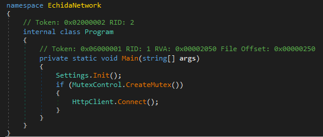
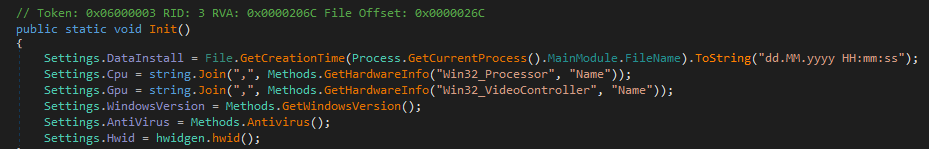
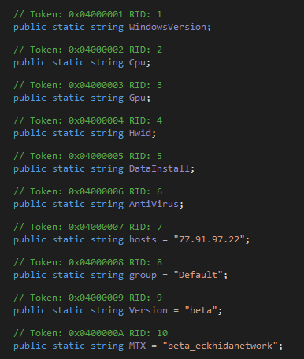
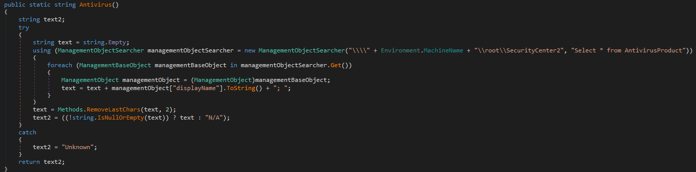
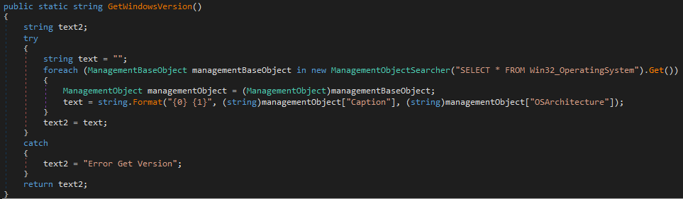
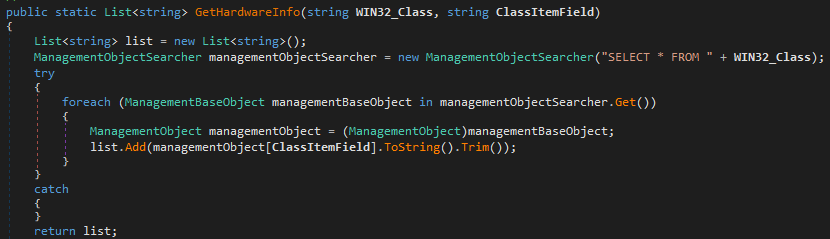
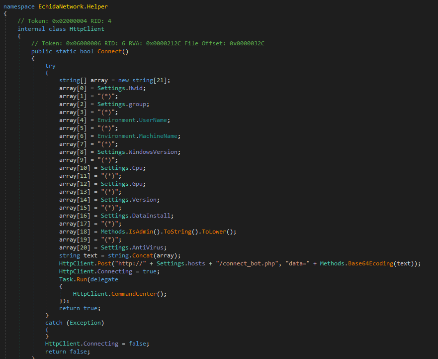
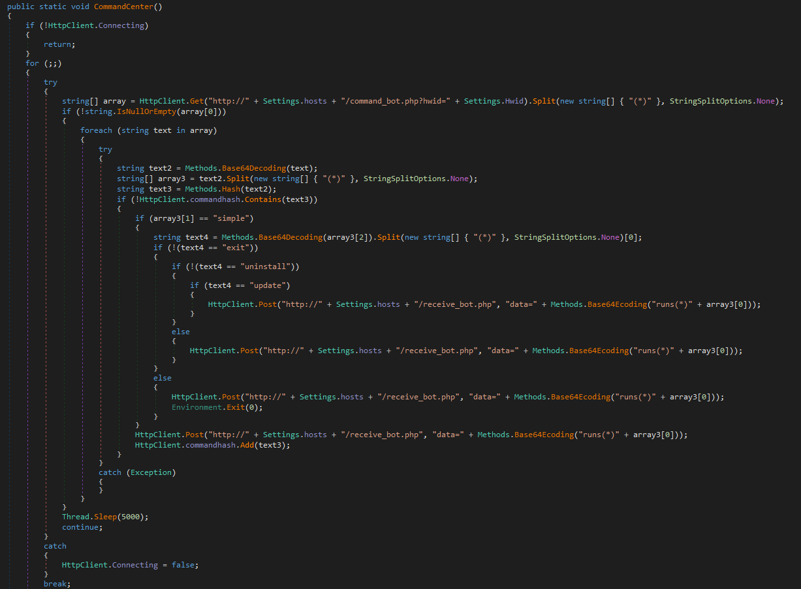

---

## 1. Overview

### 1.1 Scope

| File Name | `EchidaNetwork.exe` |
| :--- | :--- |
| md5 | `68a7d5caa4c7bfbf0bcde05f58d2f0f2` |
| sha1 | `5af3b1b149cf82bbd464841fbf250732736ea7c1` |
| sha256 | `276cdb84c5db9d081f107c821a4b28e3b7749a0924a8445d0c021de6fbac72a4` |

---

## 2. Summary

Echida Stealer is a new data collection and remote command-receiving malware written in the C# programming language. Despite limited sample data, it offers data collection capabilities and remote control features. Targeted at various purposes, its unique advantage is remote command reception. However, ethical and legal concerns surround its use, and ongoing development and testing are needed for competitiveness. There are limited samples, and samples point out for testing at this time. First sample brought to discussion by Viriback at September 4th, 2023.

Main capabilities of malware consists of receiving and running command from server, generating unique hardware identifier for every victim, mining crypto currency on victim device, adding infected computer to botnet that might be used for various purposes such as DDoS attacks.


**Analyst Note:** Beta version of the panel does not seem to work properly and has lots of typos at this point. For example, panel title is "Danshboard" and few endpoints of the server is available as open directory.


---

## 3. Technical Analysis

This section contains technical analysis of the Echida malware sample provided in Scope section.

### 3.1 Hierarchical Working

Malware starts with following function. First it gathers various information by `Settings.Init` function, creates mutex by the name specified in configuration, then it tries to connect command and control server via HTTPS protocol.


> *Figure 1: Main structure*

`Init` function performs following operations in given order:

* Gathers installation date of malware in victim device
* Gathers CPU information
* Gathers GPU information
* Gathers Windows Version
* Gathers installed antivirus product
* Generates unique hardware identifier for victim device



> *Figure 2: Configuration and enumeration routine outline*

Following figure shows malware configuration that consists of command and control server address, malware version (which is "beta" in analyzed sample) and mutex name.


> *Figure 3: Malware configuration*

### 3.2 Capabilities

Echida malware checks under following registry to detect which antivirus product is installed on compromised device:
`HKLM\Software\Microsoft\Windows\CurrentVersion\Uninstall`


> *Figure 4: Get installed antivirus product*


The malware gathers windows version through COM object.


> *Figure 5: Get windows version*

Following function screenshot provides context how Echida malware utilizes COM objects in order to gather hardware information.


> *Figure 6: Get hardware information of victim device*


### 3.3 Command and Control Communication

**Sample C2:** `77.91.97.22`

Echida malware sends following information in given order to `connect_bot.php` endpoint with `data=` parameter through HTTP connection POST method to establish first connection to command and control server:

1. Generated hardware identifier


2. Bot assigned group


3. Device user name


4. Device host name


5. Windows version


6. CPU information


7. GPU information


8. Malware version


9. Malware installation date on victim device


10. User access level (Admin or not)


11. Installed Antivirus product



> *Figure 7: Bot connection*

Echida malware can receive commands from command and control server by specifying compromised device hardware identifier. It sends request to `command_bot.php` endpoint of command and control server by using `hwid=` parameter. After mentioned request is sent, it receives a Base64 encoded command by checking `receive_bot.php`. There are few commands it can receive at the time this analysis is performed:

| Command | Command Detail |
| --- | --- |
| `exit` | Terminates sample activity|
| `uninstall` | Removes malware from compromised device|
| `update` | Updates malware sample on compromised device|

*Table 1: Commands received from server*


> *Figure 8: Receiving commands*



**Analyst Note:** Although commands and capabilities of the malware are limited at the time, with remote update and plugin installation option can be used for migration to more stabilized and foolproof infrastructure. The malware panel has various options such as steal logs and crypto mining. These features not implemented on the malware yet, but actors does not require whole new process of infection.


---

## 5. YARA Rule

```yara
rule echida_stealer {
    meta:
        author = "batcain_"
        date = "18.09.2023"
        hash = "276cdb84c5db9d081f107c821a4b28e3b7749a0924a8445d0c021de6fbac72a4"
        reference = "https://twitter.com/ViriBack/status/1698693553168236869"
    strings:
        $str1 = "/receive_bot.php" wide ascii
        $str2 = "/connect_bot.php" wide ascii
        $str3 = "/command_bot.php?hwid=" wide ascii
        $str4 = "data=" wide ascii
        $str5 = "(*)" wide ascii
        $str6 = "Windows Unknown" wide ascii
    condition:
        (all of ($str*))
}

```

---

## 6. MITRE ATT&CK Threat Matrix

1. **TA0002 Execution**

* **T1204 User Execution**

* **T1204.002 Malicious File**


2. **TA0005 Defense Evasion**

* **T1140 Deobfuscate/Decode Files or Information**


3. **TA0007 Discovery**

* **T1082 System Information Discovery**

* **T1033 System Owner/User Discovery**


4. **TA0009 Collection**

* **T1005 Data From Local System**


5. **TA0011 Command and Control**

* **T1219 Remote Access Software**


6. **TA0010 Exfiltration**

* **T1041 Exfiltration Over C2 Channel**