## 1. Introduction

Gotham Stealer, a malware threat emerging in September 2023, showcases diverse capabilities, targeting browser information, crypto wallets, and gaming accounts like Discord, Steam, and Roblox. Notably, it infiltrates systems through game crack sites and gaming-themed platforms. Gotham Stealer’s unique features, including its use of Node.js and a substantial self-contained executable size, challenge conventional perspectives on desktop malware. This introduction sets the scene for a detailed examination of Gotham Stealer’s functionalities and its implications for cybersecurity.

### 1.1 Scope

In the "Scope" section, hashes of the analyzed "Gotham Stealer" sample are provided.

| File Name | `node.exe` |
| :--- | :--- |
| md5 | `4a5b0e00ee6128a2922727a9603222a3` |
| sha1 | `1eb85f067be0a36f4a4e010ea5b2a631a2667107` |
| sha256 | `0900294009d5ce23656377e18a419757bdc818b8aa3412d6a3f1661e2cb32e17` |

---

## 2. Summary

Gotham Stealer, also called as "Revamped and strengthened Pirate", has been circulating in Telegram channels since September 2023, with its development initiated in March of the same year. Despite initial impressions suggesting it may be a copy of Pirate Stealer, our in-depth analysis by the threat intelligence and malware analysis teams reveals a unique element: its incorporation of a Discord stealer component. This distinctive feature sets Gotham Stealer apart from potential misconceptions of being a mere duplicate.

Operated by Turkish threat actors who ceased their activities on December 8, 2023, there remains a lingering concern of a potential resurgence or an upgraded version in the future. The malware displays versatile capabilities, encompassing the theft of browser information, crypto wallets, as well as Discord, Steam, and Roblox accounts. Its focus on gaming accounts leads to the dissemination of Gotham Stealer through game crack sites and websites centered around gaming themes. Notably, Gotham Stealer stands out due to its unconventional form as a Node.js self-contained executable, boasting a substantial size of 80MB—significantly larger than typical malware sizes. This characteristic fuels claims of evading malware sandboxes, challenging conventional assumptions regarding desktop malware, where JavaScript-based threats are less prevalent.

This report underscores the uniqueness of Gotham Stealer, debunking misconceptions of its origin and highlighting its potential for future threats. The unconventional use of Node.js and its distinctive size contribute to its evasive capabilities, warranting heightened attention in cybersecurity efforts.

---

## 3. Technical Analysis

This section contains the technical analysis of the malware and provides an in-depth examination of Gotham Stealer functionalities and behavior.

The introduction of the Gotham Stealer malware took place on September 12, 2023, in the @GothamPublic Telegram channel by @silvaqr and @LdcSabo Telegram accounts. A feature list accompanied this announcement, as depicted in the figure below.

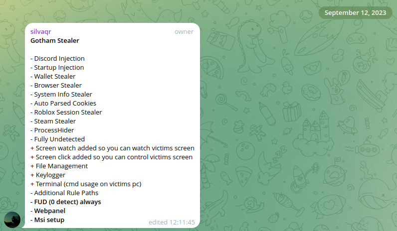
> *Figure 1: Gotham Stealer features*

The early versions of the malware builder in the panel only allowed few additional features such as achieving persistence, terminating Discord application, changing icon file and file name.

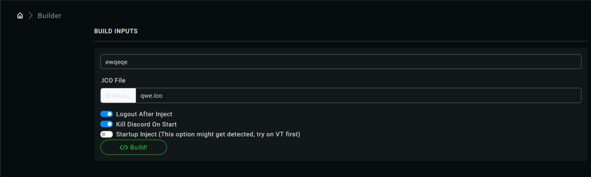
> *Figure 2: Early versions of builder*

Over time, Gotham Stealer evolved with the integration of additional features, encompassing the use of Discord webhooks for logging, an MSI file builder, rootkit capabilities, and the ability to incorporate custom file path regex. The figure below illustrates the latest version of the Gotham Stealer builder before the conclusion of the campaign.

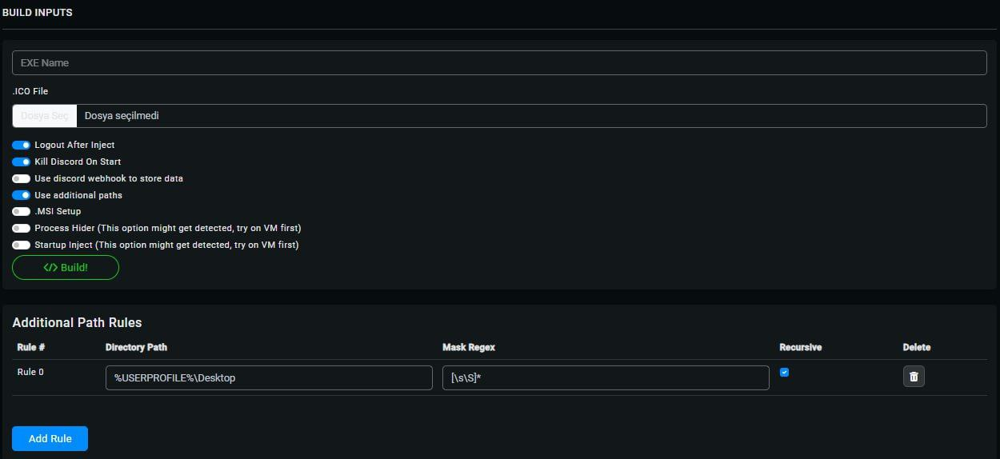
> *Figure 3: Latest version of builder*

In the building terms, Gotham Stealer adopts a relatively straightforward build procedure. However, the reverse engineering of the malware poses a considerable challenge due to the sophisticated technologies employed during the build. The following schematic diagram offers a comprehensive overview of both the build and runtime processes of Gotham Stealer. The specific phases outlined in the schema will be elaborated upon in detail during the subsequent technical analysis.


> *Figure 4: Gotham Stealer build and runtime schema*

The PDB information is embedded within the approximately 80MB malicious executable, and multiple strings within the file suggest the utilization of the Nexe project. The accompanying screenshot of the PDB path provides evidence that the mentioned project was employed in the construction of the executable.


> *Figure 5: Embedded PDB path in executable which shows nexe project release path*

The Nexe project, being an open-source initiative, is commonly employed by legitimate executables to convert JavaScript files into the EXE format. It creates a self-contained executable that incorporates the Node.js runtime and static libraries internally, eliminating the requirement for external Node or npm binaries. The utilization of the Nexe project contributes to the substantial size of the malware, surpassing typical stealer file sizes.


**Analyst Note:** The narrative also clarifies why Virustotal registers almost zero detections for Gotham Stealer. Due to the restrictions on malware file sizes, several sandboxes are unable to analyze the malware effectively. Additionally, Gotham Stealer conducts a preliminary check for a command and control (C2) connection before initiating any malicious activities. Consequently, if the malware is scanned after the associated command and control server has been dismantled, it refrains from executing malicious actions, effectively avoiding automated detection.



### 3.1 Unpacking and Deobfuscation

The main executable with 80MB file size is a self contained Node.js executable, therefore it has a lot of legit functions and syscalls. It also loads external module named node-dpapi with VirtualProtect API.

The loaded node-dpapi module is malicious and it is pretty hard to catch during analysis because of the module name. There is an open source and legitimized node module with the same name. Relation between the malicious module and the original and the legitimized public module is going to provided in next sections.

#### 3.1.1 Malicious Dll

The malicious module features numerous exported functions invoked during runtime. However, when examined as an independent DLL, it appears to have just one export. This singular export cannot be directly invoked from other executables such as rundll32. The reason is that it necessitates being called by the parent standalone executable, and the calls directed to the malicious export must be intercepted during runtime.

The sole export in the malicious module is illustrated in the following figure.

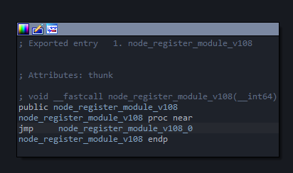
> *Figure 7: Only export of malicious module*

A function callback and a function wrapper are employed to invoke malicious node exports through a single export of the loaded malicious node-dpapi doppelganger module. The provided figure offers context on how the GOTHAM_CRYPTER node export is called, utilizing the export function callback, which only requires the exported function name.

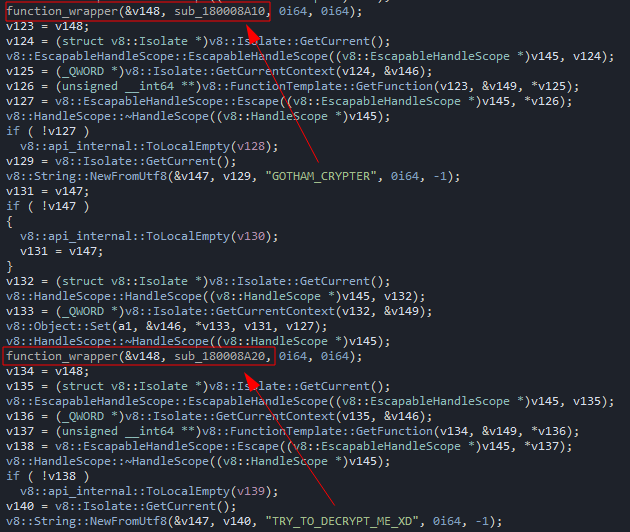
> *Figure 8: Function callbacks in malicious DLL*

Within the GOTHAM_CRYPTER function, the following operations are executed in the specified order:
1. C2 communication check: The executable terminates if C2 communication is not established.
2. Loading of Base64 string.
3. Initialization and decryption using AES.
4. Allocation of space and writing operation for lengthy ciphertexts.
5. Return of plaintext.

Same code sequence shows in runtime as following figure.


> *Figure 9: Runtime view of GOTHAM_ENCRYPT function*

Decrypted Base64 and AES encryption has been provided in the figure below.

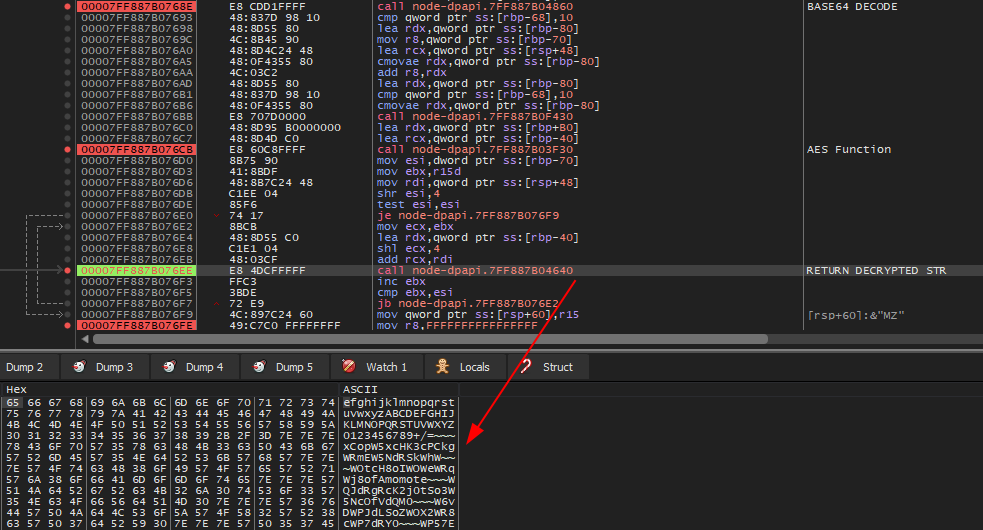
> *Figure 10: Dynamic string decryption of GOTHAM_ENCRYPT function*

The figure below contains information on the AES algorithm and the default SBOX utilized for encryption.

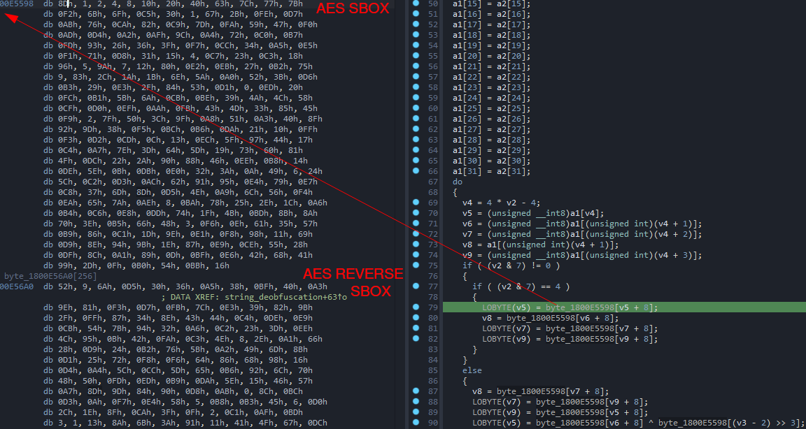
> *Figure 11: AES algorithm and constants*

The figure below illustrates the GOTHAM_CRYPTER callback function along with the provided AES key, which, in this case, is `qweasdqweasdqweasdqweasdqweasdqw` for the analyzed sample.

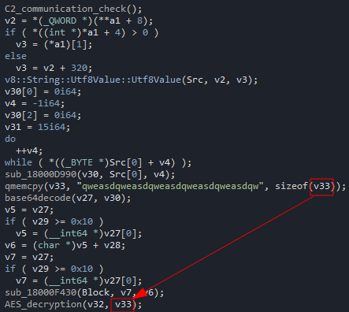
> *Figure 12: AES key given as argument to AES decryption function*

Another exported callback is the ScreenClick function, which is employed to perform mouse button clicks. The functions utilized for this task are illustrated in the following image.

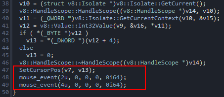
> *Figure 13: Malicious module export "ScreenClick"*

The provided function is extracted from the ScreenResolution callback export of the malicious module. It utilizes the GetSystemMetrics function with 0 and 1 argument values, returning pixel numbers corresponding to X and Y coordinates.

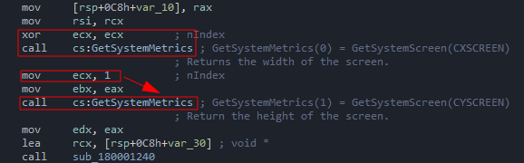
> *Figure 14: Malicious module export "ScreenResolution"*

The function callback ScreenShot is employed for capturing a screenshot of the system, as the name suggests. The illustrated function can be observed in the figure below.

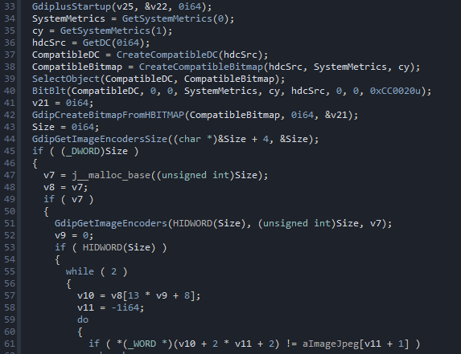
> *Figure 15: Malicious module export "ScreenShot"*

The exported malicious module, labeled Check, downloads ProcessHider.dll from the Command and Control (C2) server and subsequently maps the DLL into memory using the MapViewOfFile WINAPI function. The figure below illustrates the C2 address from which the DLL is downloaded and outlines the associated file operations.

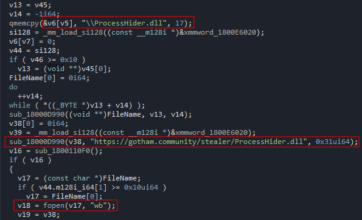
> *Figure 16: Malicious module export "Check"*

Further analysis shows the ProcessHider.dll is taken from a public Github project named ProcessHider published by kernelm0de. Comparison and similarity between the project and code block in reversed malicious module has been provided in the figure below.

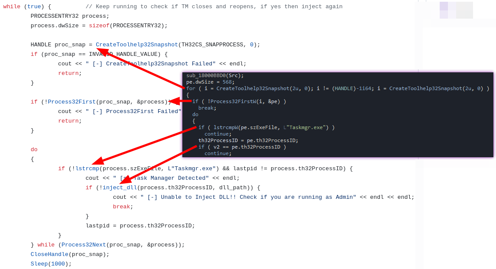
> *Figure 17: Malicious module export "Check"*

#### 3.1.2 System Artifacts

While executable is running it extracts configuration files and malicious module release version under `C:/Users/<username>/.nexe_natives` path. The index.js file consists of JavaScript export declarations of released malicious module which is being loaded in runtime.

Exact path of extracted malicious module has been provided below:
* `C://Users/<username>/.nexe_natives/win-dpapi/build/Release/node-dpapi.node`

The extracted binding.gyp file shows imported libraries such as curl, node-dpapi, Windows socket library ws2_32.dll and Normaliz.dll which is used for string encoding.

Folder overview in the left section of following figure shows detailed view of extracted files. It also shows exports of released malicious module.

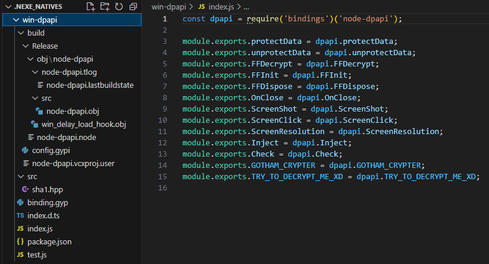
> *Figure 18: Export function declarations of malicious JavaScript payload*

Following table explains declared exports and their functionalities.

| Export | Description |
| :--- | :--- |
| `protectData` | Legitimate "win-dpapi" library are exports of the Node.js library designed to secure confidential data stored in memory |
| `unprotectData` | Legitimate "win-dpapi" library are exports of the Node.js library designed to decrypt confidential data stored in memory |
| `FFDecrypt` | Function to decrypt firefox and firefox based application database files |
| `ScreenShot` | Screenshot capture function |
| `ScreenClick` | Function which captures mouse clicks |
| `ScreenResolution` | Function which queries screen resolution |
| `Check` | Injects ProcessHider.dll library to TaskMgr.exe for rootkit capabilities |
| `GOTHAM_CRYPTER` | Function where javascript deobfuscation and C2 check is performed |
| `TRY_TO_DECRYPT_ME` | Same routine with GOTHAM_CRYPTER function, only to encrypt |

*Table 1: Exported functions of malicious module*

#### 3.1.3 Deobfuscation of Obfuscated Javascript

Upon the identification of Nexe tool usage, it became apparent that a malicious JavaScript code, originally fed into the Nexe tool, was absent. Subsequent memory analysis uncovered a memory location containing highly obfuscated JavaScript code. Extracting and deciphering this code posed the most formidable challenge in the analysis process.

Following figure shows the initial obfuscated JavaScript code in memory.

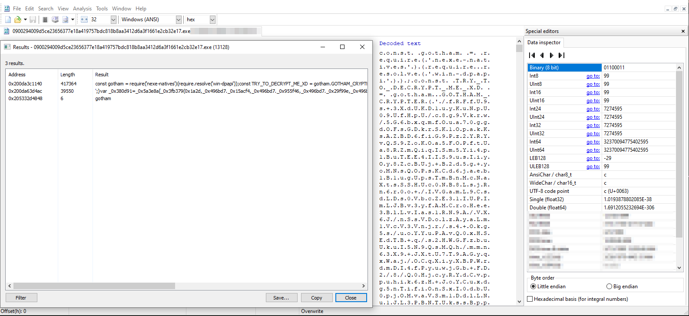
> *Figure 19: Obfuscated JavaScript in memory*

Following extraction, reformatting, and rewriting to conform with the JavaScript compiler, the initial segment of the code is depicted in Figure 20. The second line incorporates an extensive Base64-encoded and AES-encrypted blob—the encoded and encrypted blob has been given as argument to aforementioned GOTHAM_CRYPTER function—which is then transferred into an empty list.

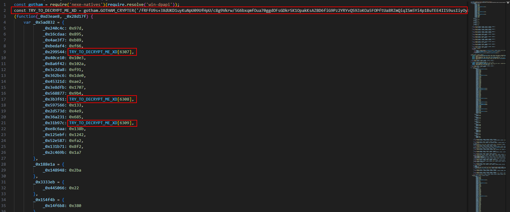
> *Figure 20: Code and string obfuscation of extracted payload*

When the blob is Base64 decoded, AES decryption is performed and splitted by tilda characters, every string becomes a JavaScript list member that modifies the pieces of code. The figure below reveals the decoded and decrypted version of the mentioned data blob.

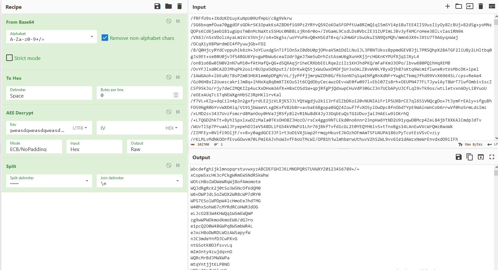
> *Figure 21: Decode and decryption of the data blob*

Upon substituting the decoded and decrypted list items, the code is displayed in the right section of the figure below.

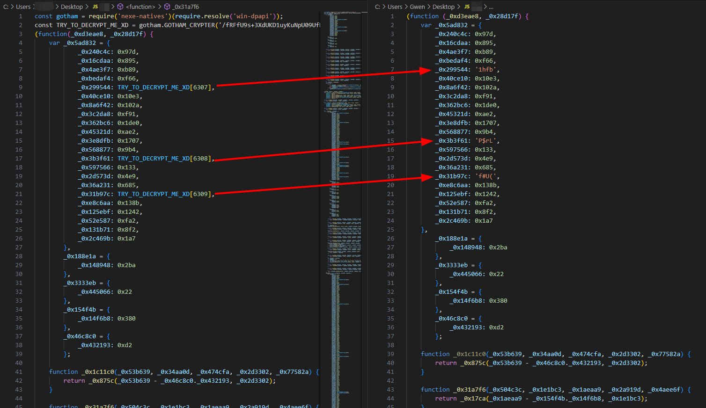
> *Figure 22: Replacing of decoded and decrypted blob*

While the code itself lacks explicit indicators regarding the specific code obfuscation tool employed, subsequent research reveals its resemblance to one of the most renowned online JavaScript code obfuscators. The figure below provides an illustrative example of the output from obfuscating a simple "Hello World" JavaScript code.

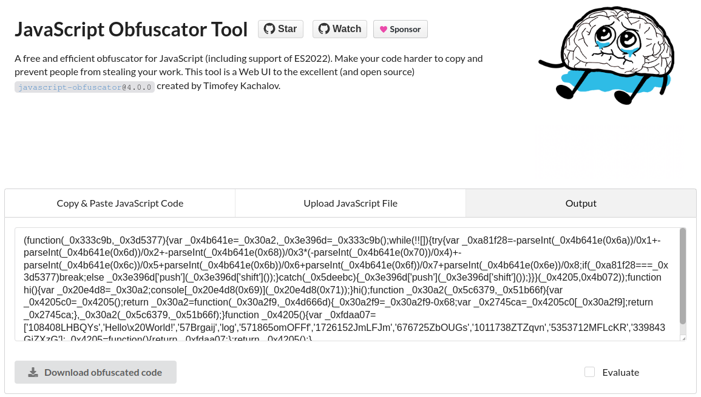
> *Figure 23: Code obfuscation example of obfuscator.io*

The observed resemblance between the codes suggests the potential to enhance the code's legibility for human interpretation. A systematic inquiry using the precise name of the obfuscator tool reveals multiple online JavaScript code deobfuscators. In this particular instance, deobfuscator-io proves to be an invaluable resource, furnishing an output that, while still obfuscated, is comparatively more comprehensible, as illustrated on the right side of Figure 24.

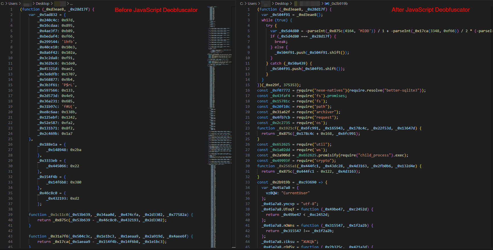
> *Figure 24: Before and after of code deobfuscation*

---

## 3.2 Command Execution

Upon initial analysis of the JavaScript file, it becomes evident that GothamStealer possesses the capability to execute PowerShell commands on the compromised system.


 **Analyst Note:** Since Gotham Stealer has the capability to execute PowerShell commands, the potential functionalities of the malware extend to the imagination of the attacker. Depending on the attacker's choice, Gotham Stealer can function as a loader for other malware, be integrated with ransomware, serve as a node in a botnet, or act as a spreader, among other possibilities.



The following command delineates a concise path for the executable to write and subsequently run.

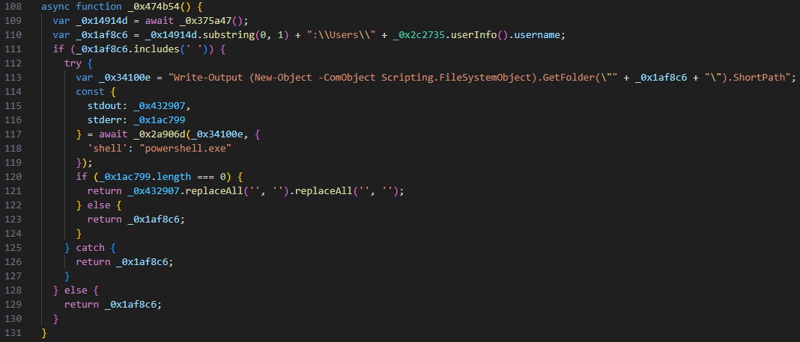
> *Figure 25: PowerShell commandline utility*

The PowerShell command captured in the screenshot collects process identifiers and utilizes taskkill.exe to terminate a specified process. Additionally, the malware exhibits the capability to disable browser protection.

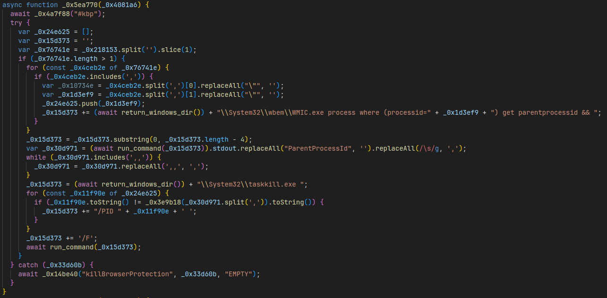
> *Figure 26: Termination of process via PowerShell and taskkill.exe*

### 3.2.1 Persistence

Gotham Stealer establishes persistence in the system by adding its malicious executable to the startup registry key through PowerShell. The command used for this operation is illustrated in the following figure.

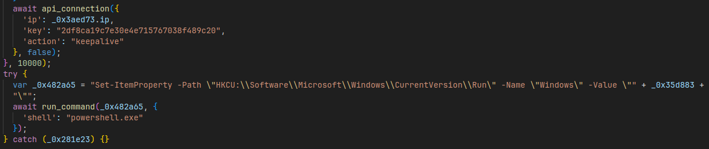
> *Figure 27: Executable adding itself to start-up registry key*

---

## 3.3 Data Collection

Gotham Stealer incorporates a server-side regex module, enabling MaaS (Malware-as-a-Service) operators to add custom regex patterns. These patterns empower attackers to collect specific information within the data that Gotham Stealer is designed to pilfer. Following figure provides context for C2 endpoint used for the mentioned regex module.

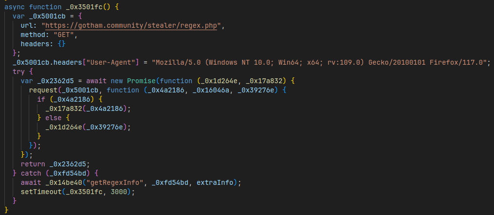
> *Figure 28: Function for receiving custom regex from C2*

Gotham Stealer possesses the capability to extract cookies, browsing history, sessions, bookmarks, and saved login credentials from a variety of browsers. Figure 29 illustrates the browsers and their corresponding checked paths within the Gotham Stealer code.

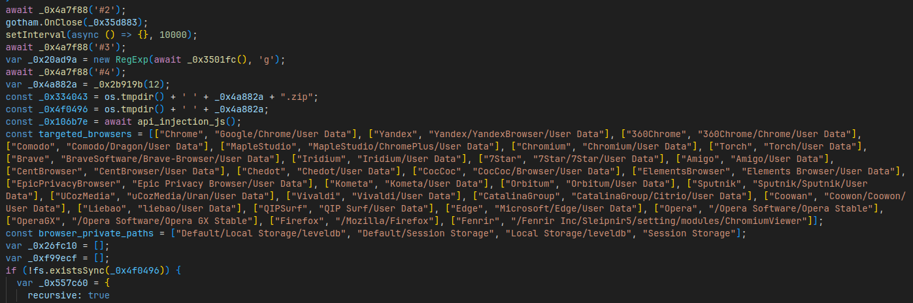
> *Figure 29: Targeted browsers*

Full list of targeted browsers and applications which includes game accounts and chat applications has been provided in the following table.

| | | | |
| :--- | :--- | :--- | :--- |
| Chrome | Yandex | 360Chrome | Comodo |
| MapleStudio | Chromium | Torch | Brave |
| Iridium | 7Star | Amigo | CentBrowser |
| Chedot | CocCoc | ElementBowser | EpicPrivacyBrowser |
| Kometa | Orbitum | Sputnik | UCozMedia |
| Vivaldi | CatalinaGrup | Coowan | Liebao |
| QIPSurf | Edge | Opera | OperaGX |
| Firefox | Fenrir | Steam | Roblox |
| Discord | Minecraft | Exodus | Growtopia |

*Table 2: Targeted applications*

Gotham Stealer focuses on browser-installed crypto wallet extensions. The code segment in the figure below displays the statically checked extensions within the browser.

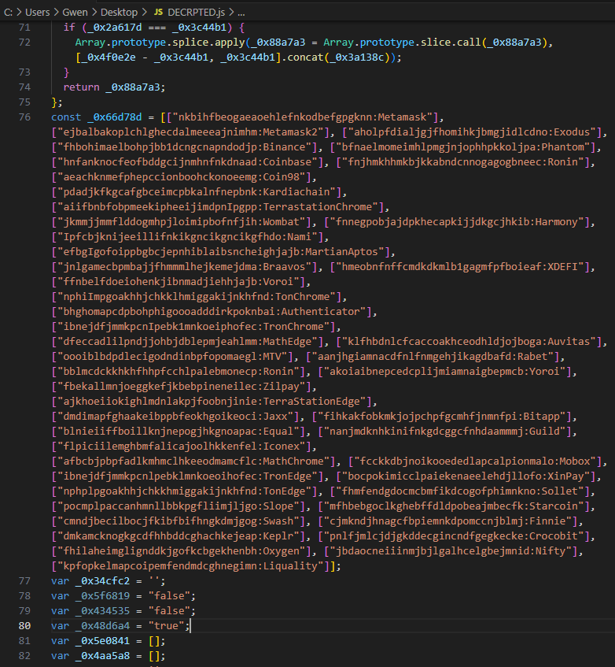
> *Figure 30: Targeted crypto extensions statically written in Gotham Stealer code*

The complete list of targeted extensions has been specified in the following table.

| Extension ID | Extension Name |
| :--- | :--- |
| `nkbihfbeogaeaoehlefnkodbefgpgknn` | Metamask |
| `ejbalbakoplchlghecdalmeeeajnimhm` | Metamask2 |
| `aholpfdialjgjfhomihkjbmgjidlcdno` | Exodus |
| `fhbohimaelbohpjbb1dcngcnapndodjp` | Binance |
| `bfnaelmomeimhlpmgjnjophhpkkoljpa` | Phantom |
| `hnfanknocfeofbddgcijnmhnfnkdnaad` | Coinbase |
| `fnjhmkhhmkbjkkabndcnnogagogbneec` | Ronin |
| `aeachknmefphepccionboohckonoeemg` | Coin98 |
| `pdadjkfkgcafgbceimcpbkalnfnepbnk` | Kardiachain |
| `aiifbnbfobpmeekipheeijimdpnlpgpp` | TerrastationChrome |
| `jkmmjjmmflddogmhpjloimipbofnfjih` | Wombat |
| `fnnegpobjajdpkhecapkijjdkgcjhkib` | Harmony |
| `lpfcbjknijeeillifnkikgncikgncikgfhdo` | Nami |
| `efbglgofoippbgbcjepnhiblaibsncheighjajb` | MartianAptos |
| `jnlgamecbpmbajjfhmmmlhejkemejdma` | Braavos |
| `hmeobnfnffcmdkdkmlblgagmfpfboieaf` | XDEFI |
| `ffnbelfdoeiohenkjibnmadjiehhjajb` | Voroi |
| `nphilmpgoakhhjchkklhmiggakijnkhfnd` | TonChrome |
| `bhghomapcdpbohphigoooadddirkpoknbai` | Authenticator |
| `ibnejdfjmmkpcnlpebk1mnkoeiphofec` | TronChrome |
| `dfeccadlilpndjjohbjdblepmjeahlmm` | MathEdge |
| `klfhbdnlcfcaccoakhceodhldjojboga` | Auvitas |
| `oooiblbdpdlecigodndinbpfopomaegl` | MTV |
| `aanjhgiamnacdfnlfnmgehjikagdbafd` | Rabet |
| `bblmcdckkhkhfhhpfcchlpalebmonecp` | Ronin |
| `akoiaibnepcedcplijmiamnaigbepmcb` | Yoroi |
| `fbekallmnjoeggkefjkbebpineneilec` | Zilpay |
| `ajkhoeiiokighlmdnlakpjfoobnjinie` | TerraStationEdge |
| `dmdimapfghaakeibppbfeokhgoikeoci` | Jaxx |
| `fihkakfobkmkjojpchpfgcmhfjnmnfpi` | Bitapp |
| `blnieiiffboillknjnepogjhkgnoapac` | Equal |
| `nanjmdknhkinifnkgdcggcfnhdaammmj` | Guild |
| `flpiciilemghbmfalicajoolhkkenfel` | Iconex |
| `afbcbjpbpfadlkmhmclhkeeodmamcfic` | MathChrome |
| `fcckkdbjnoikooededlapcalpionmalo` | Mobox |
| `ibnejdfjmmkpcnlpebklmnkoeoihofec` | TronEdge |
| `bocpokimicclpaiekenaeelehdillofo` | XinPay |
| `nphplpgoakhhjchkkhmiggakijnkhfnd` | TonEdge |
| `fhmfendgdocmcbmfikdcogofphimnkno` | Sollet |
| `pocmplpaccanhmnllbbkpgfliimjljgo` | Slope |
| `mfhbebgoclkghebffdldpobeajmbecfk` | Starcoin |
| `cmndjbecilbocjfkibfbifhngkdmjgog` | Swash |
| `cjmkndjhnagcfbpiemnkdpomccnjblmj` | Finnie |
| `dmkamcknogkgcdfhhbddcghachkejeap` | Keplr |
| `pnlfjmlcjdjgkddecgincndfgegkecke` | Crocobit |
| `fhilaheimglignddkjgofkcbgekhenbh` | Oxygen |
| `jbdaocneiiinmjbjlgalhcelgbejmnid` | Nifty |
| `kpfopkelmapcoipemfendmdcghnegimn` | Liquality |

*Table 3: Targeted browser extensions*


 **Analyst Note:** While Gotham Stealer does not have a dedicated function for draining wallets, the flexibility provided by its command-line interface empowers the actor to potentially drain or substitute discovered wallets with those controlled by the actor.



The Discord messaging app is one of the previously mentioned targeted applications. To collect Discord information, Gotham Stealer leverages the fact that the desktop app is built on Electron and decompresses the asar file. Subsequently, it retrieves the Discord user token using the regex pattern depicted in Figure 31.

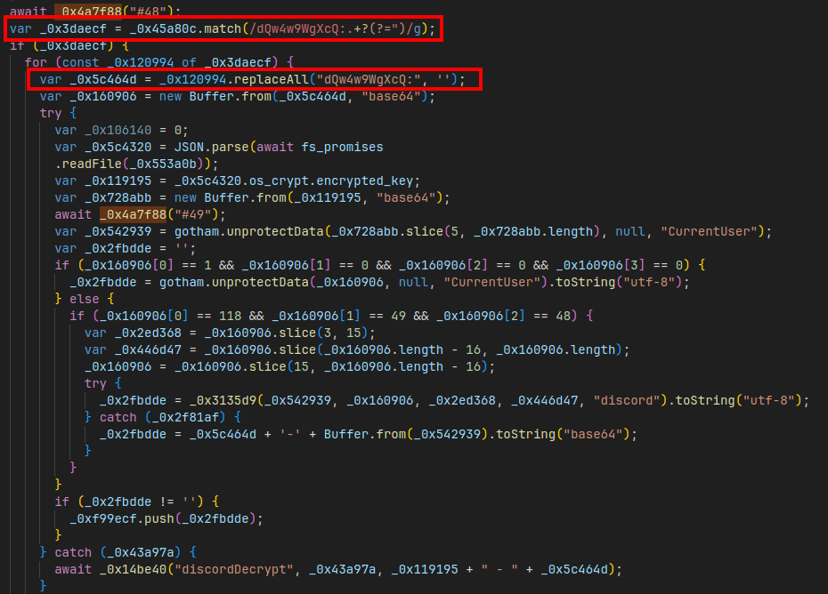
> *Figure 31: Discord token recognition*

---

## 3.4 Command and Control

The analyzed sample utilizes the C2 domain `gotham.community`, as illustrated in the figure below that shows the DNS resolve request for this malicious domain.

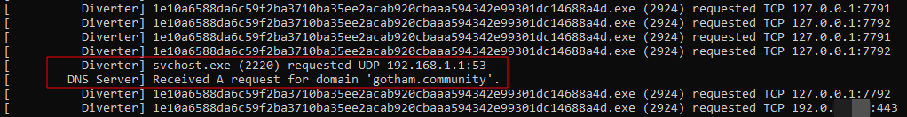
> *Figure 32: C2 DNS resolve request*

The initial connection begins with communication to the `ip.php` endpoint on the C2 server. This logs the victim's public IP address to the panel, and subsequently, the panel routes a victim alert to the Discord server with inline HTML. The following function executes the explained operation.

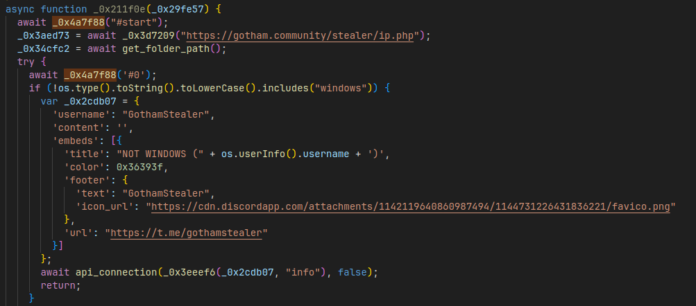
> *Figure 33: Beginning of C2 interaction*

The interaction with the malware's API is facilitated by a POST request to the `api.php` endpoint. The function responsible for this API interaction is depicted in the following figure.

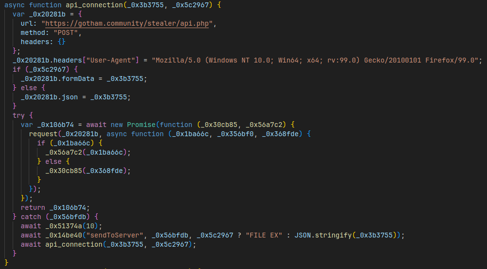
> *Figure 34: API endpoint of C2*

The malicious DLL utilized by Gotham Stealer can exclusively decrypt cookies from limited applications and recognized browsers. Further cookie decryption is also carried out on the server side, specifically on the `decrypt.php` endpoint within the C2 infrastructure. The following function illustrates the process of cookie decryption on the server side.

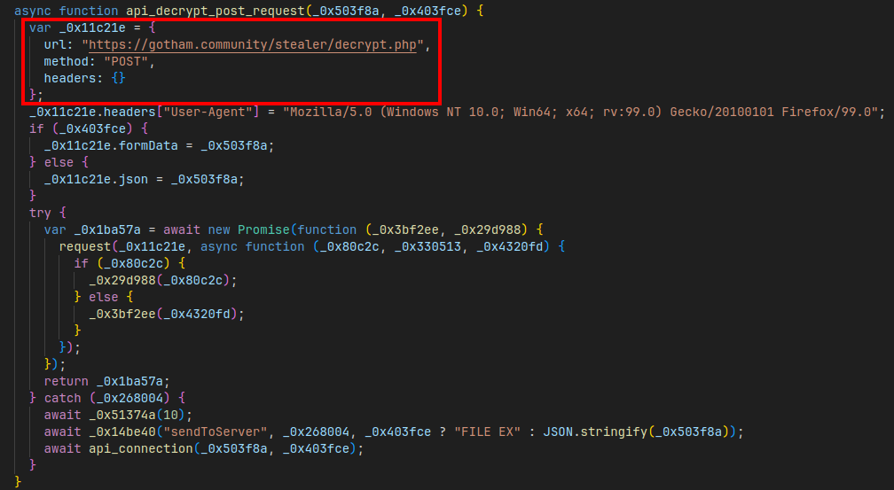
> *Figure 35: Server-side decryption endpoint for cookies*

Following commands are default websocket commands used in JavaScript "ws" library. Websocket connection made by GothamStealer also uses listed commands.

| Command | Command Detail |
| :--- | :--- |
| `click` | Calls node-dpapi DLL "ScreenClick" export |
| `screen` | Calls node-dpapi DLL "ScreenShot" export |
| `screen update` | It triggers dll "ScreenShot" call on command |
| `file` | Specifies file tree and detailed information of files/folders |
| `file init` | Specifies documents, downloads, pictures, videos, desktop paths |
| `get` | Gets requested file/folder |
| `del` | Deletes requested file/folder |
| `download` | Downloads requested file |
| `cmd` | Runs specified command |
| `send` | Performs send action to server |

*Table 4: C2 commands*

The function depicted in the following figure illustrates how Gotham Stealer streams the victim's screen and executes the screenclick function, enabling the actor to view the victim's screen in an embedded viewer on the C2 panel and interact with the compromised system's desktop by clicking.

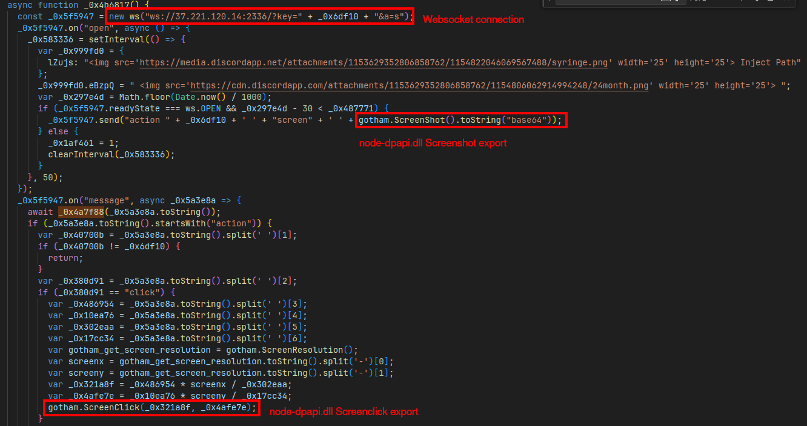
> *Figure 36: Function responsible for screen share and click*

The subsequent figure reveals the C2 endpoint employed by actors to observe and interact with the victim's screen.

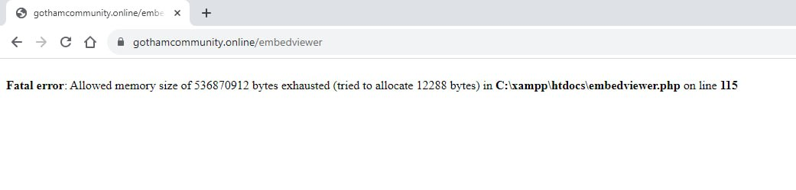
> *Figure 37: Display endpoint of victim screen on C2*

---

## 3.5 Logging Mechanism

For both debugging purposes and logging, Gotham Stealer incorporates tags for each module. During runtime, these tags provide actors and developers with information on the functions that executed and their success. To facilitate this, an empty list is allocated at the beginning of the malicious JavaScript file. As modules are triggered, the module tag and result are pushed to the allocated list. Once the operations are completed, this information is sent to the server.

The left side of the figure below displays the tags employed in modules. The code section illustrates how logs are added to the list.

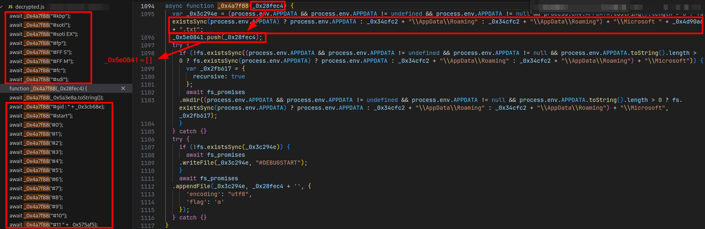
> *Figure 38: The main debugging and logging mechanism of Gotham malware*

The login information pilfered from browsers is documented in a `login.txt` file on the server side, as indicated by the message shown in Figure 39.

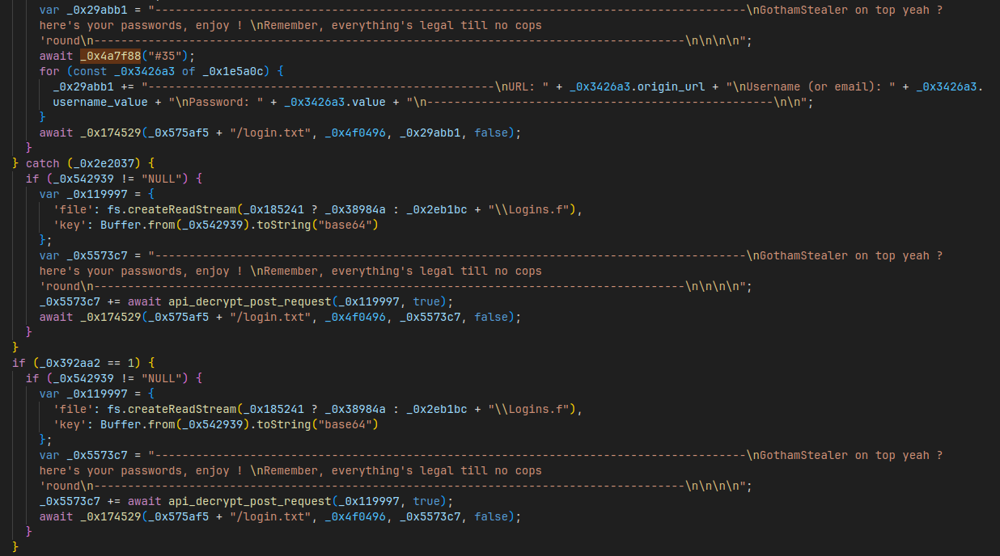
> *Figure 39: Login log messages written for affiliate*

The cookie information pilfered from browsers and applications is documented in a `cookie.txt` file on the server side, as indicated by the message shown in Figure 40.

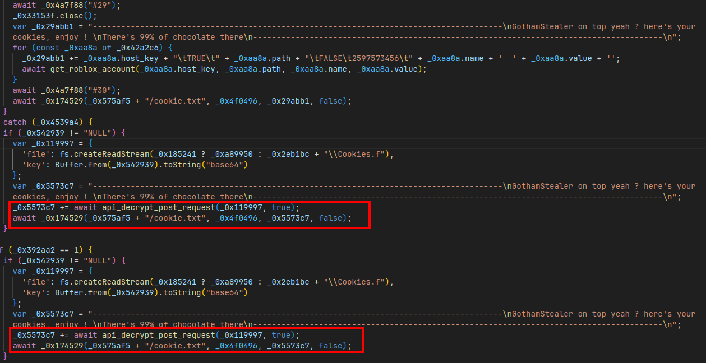
> *Figure 40: Cookie log messages written for affiliate*

---

## 3.6 Data Exfiltration

While Gotham Stealer primarily utilizes a WebSocket connection and C2 API traffic for data exfiltration, it also possesses the capability to utilize publicly recognized file uploading services, such as GoFile, to upload the collected data.

To utilize the GoFile API for exfiltration, Gotham Stealer initially needs to execute an API request to the server before file uploading. To achieve this, a request must be made to the URL specified in the figure below.

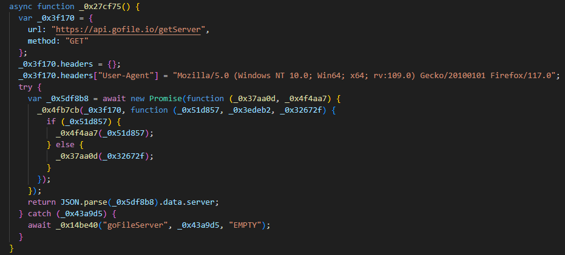
> *Figure 41: Allocation request made by Gotham Stealer to Gofile API*

Upon obtaining a dynamic upload URL from the service, Gotham Stealer initiates the file upload to the designated space, making a request to the endpoint illustrated in the following figure.

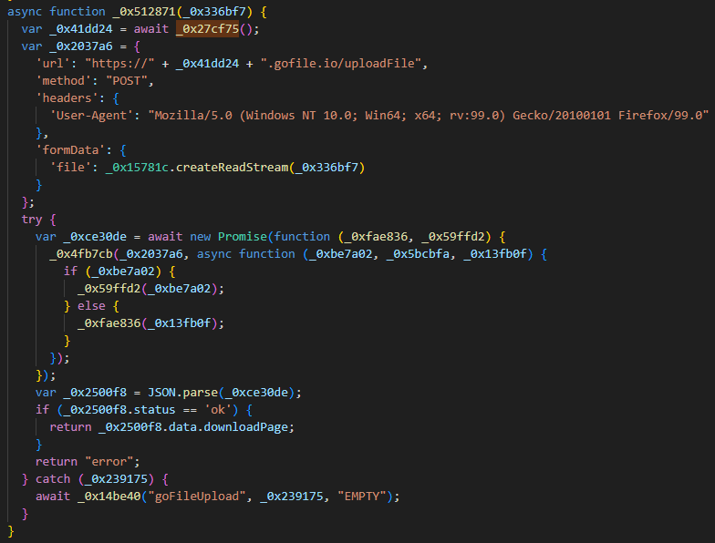
> *Figure 42: Upload request made by Gotham Stealer to Gofile API*


 **Analyst Note:** Gotham Stealer is dependent on the free plan offered by the mentioned service, preventing the extraction of the service API key and victim data collection from the analyst's side. Despite the current situation, it is noteworthy that in future instances, this feature might be updated to utilize actor-specified API keys for the service.



 **Analyst Note:** Some actors have requested malware developers to incorporate the usage of a Telegram webhook and add HTML embedding to the Telegram implementation. While this feature has not been fulfilled by the developers, the developers implied an intention to implement it in the future.



---

## 3.7 Comparison with PirateStealer

Gotham Stealer rebranding itself as "Revamped and strengthened PirateStealer" misinterpreted by malware news channels as a copycat of PirateStealer. There are claims among the affiliates that the Gotham Stealer developer "Sabo" also contributed in development of PirateStealer with the original owner, the "Stanley".

The claims among the Turkish affiliates whom are familiar with the work of Gotham developer "Sabo" has been provided in the screenshot below.

 | | |
 | --- | --- | 
 | 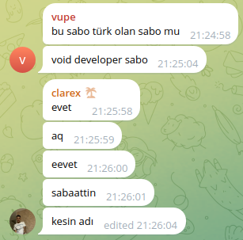 | 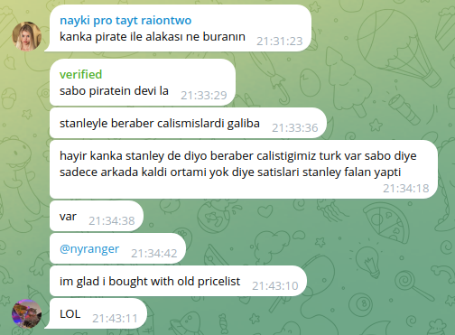 |
> *Figure 43: Affiliates familiar with the Gotham Stealer developer "Sabo"* 

Following figure shows the GitHub account of "Stanley" at the time the report is written.

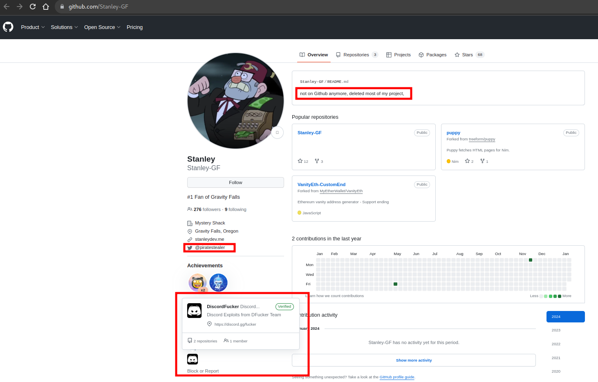
> *Figure 44: Github account of original PirateStealer developer*

The resemblance between PirateStealer and Gotham Stealer is unmistakable, yet Gotham malware exhibits significantly greater capabilities beyond merely pilfering Discord accounts and injecting JavaScript into browsers for cookie theft, as detailed throughout the report. The provided figure highlights a small portion of Gotham Stealer that shares similarities with PirateStealer.

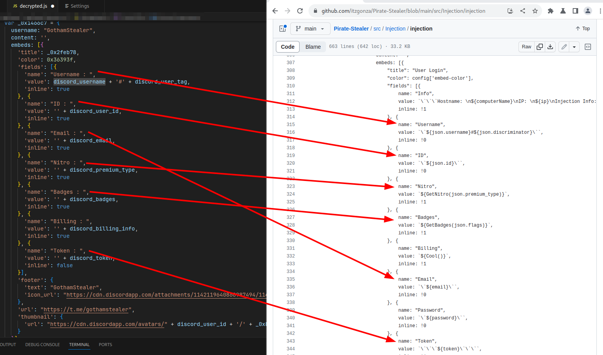
> *Figure 45: PirateStealer written by Stanley-GF compared with Gotham Stealer*

---

## 3.8 Malware Distribution

Gotham Stealer primarily spreads through malicious advertisements promoting actor-controlled game, game cheat, and mod websites. The figure below illustrates a piece of malware distribution advice exchanged between Gotham Stealer dealer "@silvaqr" and affiliates.

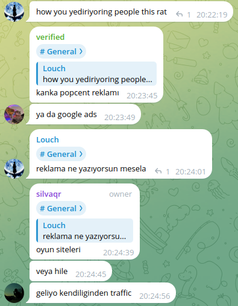
> *Figure 46: Malware distribution advice from dealer of Gotham Stealer*

 
**Analyst Note:** Gotham Stealer declared the cessation of its operations on December 8, 2023, citing real-life complications as the reason.


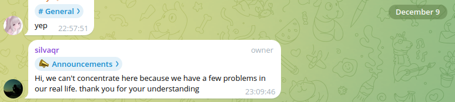
> *Figure 47: Temporary pause on Gotham Stealer development*

Despite being perceived as a permanent halt in the stealer's development, the developer updated the malware's features two days before making the announcement. Furthermore, the sale of lifetime support to affiliates with close ties to the Gotham Stealer team, along with the continuous suggestion of impending updates, increases the likelihood of Gotham Stealer making a return or reemerging with a new campaign.

---

## 4. Conclusion

In conclusion, the comprehensive analysis of Gotham Stealer underscores its multifaceted threat, with the malware adeptly targeting a diverse range of sensitive data, including browser information, crypto wallets, and various gaming accounts such as those on Discord, Steam, and Roblox. Particularly noteworthy is the dissemination strategy employed by Gotham Stealer, utilizing game crack sites and platforms themed around gaming to infiltrate systems. The malware's unique characteristics, including its use of Node.js and a substantial self-contained executable size, challenge traditional assumptions in the realm of desktop malware. The vigilance of cybersecurity efforts is paramount, considering the potential resurgence or evolution of Gotham Stealer. Its distinctive features demand ongoing attention and proactive measures to counteract its threats effectively.

---

## 5. Detection & Mitigation

By integrating these detection and mitigation measures, organizations can fortify their defenses against Gotham Stealer, reducing the likelihood of successful infections and enhancing overall cybersecurity resilience. Regular updates and reinforcement are crucial for maintaining a strong security posture.

1. **File System Security:**
   * **Detection:** Regularly scan the file system for malicious modules and JavaScript files at `C:/Users/<username>/.nexe_natives/`. Any presence of these files indicates potential infection.
   * **Mitigation:** Deploy endpoint protection to monitor and scan the file system. Limit write access to critical directories to prevent unauthorized modifications.

2. **Registry Security:**
   * **Detection:** Monitor the Windows Registry for changes, specifically additions to `HKCU\Software\Microsoft\Windows\CurrentVersion\Run`. Gotham Stealer's presence in this registry key suggests an attempt at persistence.
   * **Mitigation:** Enforce strict access controls, audit the registry regularly, and promptly remove any suspicious entries to prevent unauthorized modifications.

3. **Process Injection Prevention:**
   * **Detection:** Use process monitoring tools to identify instances of ProcessHider.dll being injected into TaskMgr.exe.
   * **Mitigation:** Implement measures to prevent unauthorized process injections, including application whitelisting.

4. **Network Security:**
   * **Detection:** Analyze network traffic for JavaScript WebSocket connections, focusing on distinct protocols used by Gotham Stealer.
   * **Mitigation:** Employ firewalls to inspect and filter traffic, especially WebSocket connections. Regularly update rules to block outbound connections to known malicious domains.

5. **IoC-Based Defense:**
   * **Detection:** Implement IoCs, such as C2 domain names, in IDS, IPS, and firewalls for quick detection and blocking.
   * **Mitigation:** Regularly update security controls based on threat intelligence feeds to enhance defense against evolving threats.

6. **YARA Rule Deployment:**
   * **Detection:** Integrate the provided YARA rule into security scanners to identify Gotham Stealer's characteristics in process memory dumps.
   * **Mitigation:** Proactively run YARA rule checks on process memory dumps for early detection and response.

7. **User Training:**
   * **Mitigation:** Conduct regular cybersecurity awareness training to educate users on the risks of downloading files from untrusted sources. Encourage the prompt reporting of suspicious activities.

### 5.1 MITRE ATT&CK Threat Matrix

1. **TA0001 Initial Access**
   * **T1566 Phishing**
     * **T1566.003 Spearphishing via Service**
2. **TA0002 Execution**
   * **T1047 Windows Management Instrumentation**
   * **T1059 Command and Scripting Interpreter**
     * **T1059.003 Windows Command Shell**
     * **T1059.001 PowerShell**
     * **T1059.007 JavaScript**
   * **T1204 User Execution**
     * **T1204.002 Malicious File**
3. **TA0003 Persistence**
   * **T1547 Boot or Logon Autostart Execution**
     * **T1547.001 Registry Run Keys / Startup Folder**
4. **TA0004 Privilege Escalation**
   * **T1547 Boot or Logon Autostart Execution**
     * **T1547.001 Registry Run Keys / Startup Folder**
   * **T1055 Process Injection**
     * **T1055.002 Portable Executable Injection**
5. **TA0005 Defense Evasion**
   * **T1014 Rootkit**
   * **T1140 Deobfuscate/Decode Files or Information**
   * **T1055 Process Injection**
     * **T1055.002 Portable Executable Injection**
6. **TA0006 Credential Access**
   * **T1539 Steal Web Session Cookie**
   * **T1555 Credentials from Password Stores**
     * **T1555.003 Credentials from Web Browsers**
   * **T1056 Input Capture**
     * **T1056.001 Keylogging**
     * **T1056.002 GUI Input Capture**
7. **TA0007 Discovery**
   * **T1082 System Information Discovery**
   * **T1217 Browser Information Discovery**
   * **T1083 File and Directory Discovery**
   * **T1057 Process Discovery**
8. **TA0009 Collection**
   * **T1113 Screen Capture**
   * **T1005 Data from Local System**
   * **T1185 Browser Session Hijacking**
   * **T1056 Input Capture**
     * **T1056.001 Keylogging**
     * **T1056.002 GUI Input Capture**
9. **TA0011 Command and Control**
   * **T1102 Web Service**
     * **T1102.002 Bidirectional Communication**
   * **T1573 Encrypted Channel**
     * **T1573.002 Asymmetric Cryptography**
   * **T1132 Data Encoding**
     * **T1132.001 Standard Encoding**
10. **TA0010 Exfiltration**
    * **T1567 Exfiltration Over Web Service**
      * **T1567.004 Exfiltration Over Webhook**
    * **T1041 Exfiltration Over C2 Channel**
11. **TA0040 Impact**
    * **T1657 Financial Theft**

### 5.2 Yara Rule

```yara
rule MAL_WIN_x64_Stealer_Gotham {
    meta:
        description = "Detects Gotham Stealer malicious node-dpapi module"
        author = "@batcain_"
        date = "2024-01-05"
    strings:
        $str1 = "protectData" wide ascii
        $str2 = "FFDecrypt" wide ascii
        $str3 = "ScreenShot" wide ascii
        $str4 = "ScreenClick" wide ascii
        $str5 = "GOTHAM_CRYPTER" wide ascii
        $str6 = "TRY_TO_DECRYPT_ME_XD" wide ascii
        $str7 = "TaskMgr.exe" wide ascii nocase
        $str8 = "ProcessHider.dll" wide ascii
    condition:
        all of them and filesize < 3MB
}
```
### 5.3 IoC

```
gotham.community
gothamcommunity.online
gothamcommunity.com
gothamproject.org
gothamxproject.com
40.66.40.98
5.178.111.75
45.131.2.208
44476e9a63d352e5311ace04cfa3ddff8ce22b0a187ded70b4bfd1e8354b31e6
58d84e754185bd0e6cb06010d3750ee8e261de9d13013ff0d158902af8432cc2
9f925da352a1563930405a7b11b3c52a3a905a59898a480bd80352d6bd5cfca1
96a29f12a55d2bba11ec76ea309f88b4be871f35591c741056d4272da5c06a3e
1672f5073ed2d78d16711e0f02df3fb0de8285f5559791ee73851fa9745ed8db
1e10a6588da6c59f2ba3710ba35ee2acab920cbaaa594342e99301dc14688a4d
287d986e191dcd949940812b681fa20f031ac8efdc117cc1b6849a55b87fd3b1
e0ec53001d556f1fb1d8a2806f1013824eeb823d61f0e1fd0a965f42fe1f389b
```


## References

1. Nexe Github page: https://github.com/nexe/nexe

2. JavaScript legitimized node-dpapi module: https://github.com/bradhugh/node-dpapi

3. Open source ProcessHider project Github page: https://github.com/kernelm0de/ProcessHider

4. CyberChef recipe: https://cyberchef.org/#recipe=From_Base64('A-Za-z0-9%2B/%3D',true,false)To_Hex('Space',0)AES_Decrypt(%7B'option':'UTF8','string':'qweasdqweasdqweasdqweasdqweasdqw'%7D,%7B'option':'Hex','string':''%7D,'ECB/NoPadding','Hex','Raw',%7B'option':'Hex','string':''%7D,%7B'option':'Hex','string':''%7D)Split('~~~','%5C%5Cn')

5. JavaScript Obfuscator project website: https://obfuscator.io/

6. Website used for online JavaScript deobfuscation: https://obf-io.deobfuscate.io/

7. GoFile file upload service: https://gofile.io/welcome

8. "Stanley" Github account link: https://github.com/Stanley-GF

9. PirateStealer Github link: https://github.com/StanleyPirateStealer/Piratestealer