---

## 1. Overview

### 1.1 Scope

| File Name | `stealer.exe` |
| :--- | :--- |
| md5 | `bdc486117f48fef2b268ad2de305ef3d` |
| sha1 | `52f907d6325e3c5ccb72baf7589d1dbe81f5df80` |
| sha256 | `b37ab91f8163344b775edc9a4378d44fdfddbac3b0cd3fceaf670f79b06bc362` |


---

## 2. Summary

The evolving landscape of cyber threats continues to present significant challenges for individuals and organizations worldwide. In recent years, a new strain of malware, known as Mystic Stealer, has emerged as a prominent threat in the digital realm. This report aims to provide an in-depth analysis of Mystic Stealer, a stealer malware that first surfaced in April 2023. Its builder and panel are being actively traded in underground forums, following a Malware-as-a-Service (MaaS) model.

Mystic Stealer represents a basic yet potent stealer malware that specifically targets browser information, system specifics, screenshots, and various browser extension wallets, including cold crypto wallets. Stealing capabilities of Mystic Stealer include:

* **Browser Hijacking:** Passwords, History, Credit Cards, Sessions, Cookies, Autofill.

* **Extensions:** Crypto wallets, Password managers, Multi-factor authenticators.

* **Cold wallets**

* **System information**

* **Screenshot**


### 2.1 Mystic Panel

Panel images in this section are taken from the public Telegram sales channel of Mystic Stealer malware. Although Mystic Stealer itself is written in C, the panel is written in the Python programming language alongside Bootstrapper and Django frameworks. At the time, the malware panel's default SSH (22) and HTTP (80) ports are open. Current infrastructure runs on the Ubuntu operating system and nginx web server with version 1.18.0. Based on these parameters, other addresses that host the Mystic Stealer Panel are provided in the IOC section.

The malware builder is integrated into the malware panel which can be configured to add anti-virtualization and anti-reverse engineering techniques.

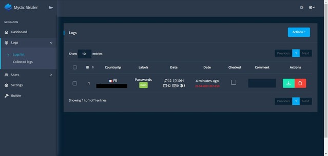
> *Figure 1: Log panel*

Settings page enables panel users to configure the malware and prefer information type which they want to be stolen.

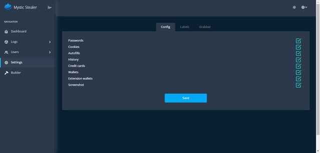
> *Figure 2: Panel filter configuration to view stolen information*


Panel users can change the built malware file format into `.exe` or `.dll`. It also allows users to add more than one command and control server address.

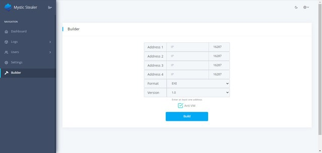
> *Figure 3: Malware builder in panel*
 

---

## 3. Technical Analysis

This section contains technical analysis of the Mystic stealer sample provided in the Scope section.

### 3.1 String and Code Obfuscation

Analyzed mystic stealer sample involves string obfuscation. Strings are either XOR or character encoded.

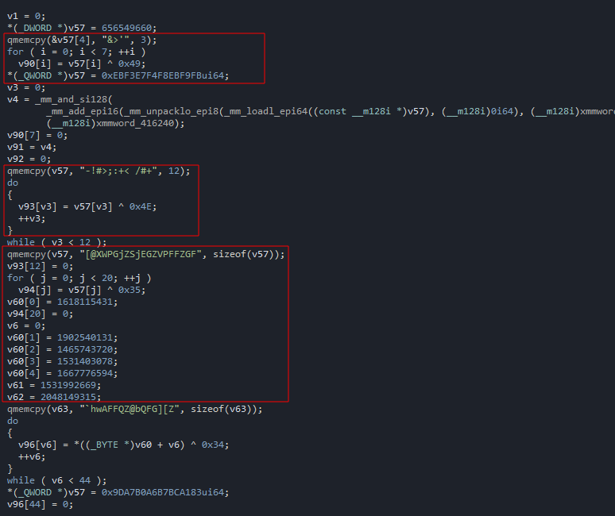
> *Figure 4: String obfuscation*

Analyzed Mystic stealer doesn't include an IAT table since all the API calls are made by a custom implemented API wrapper. The return of the API call wrapper is passed to the EAX register, then it is called. Also, it loads the `ntdll` library itself. This way, malware evades static analysis engines of various sandboxes and escapes from software breakpoints on API functions.

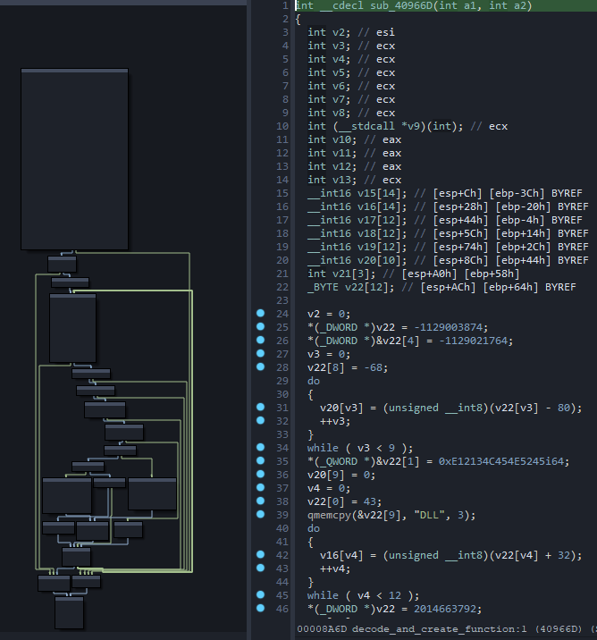
> *Figure 5: API wrapper*

### 3.2 Hierarchical Working

At first stages of main function execution, the command and control server IP is decoded. The most important part in the analysis is the command and control server connection check malware performs. If TCP communication with the IP cannot be established, the sample stops execution.

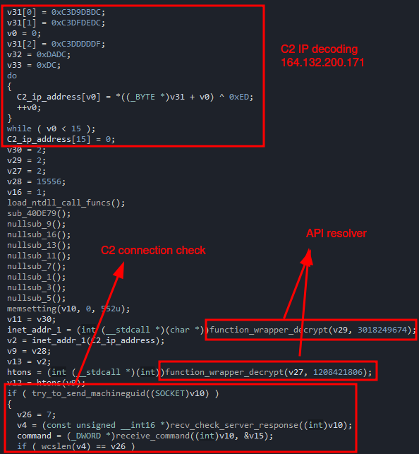
> *Figure 6: C2 decoding and communication check* 

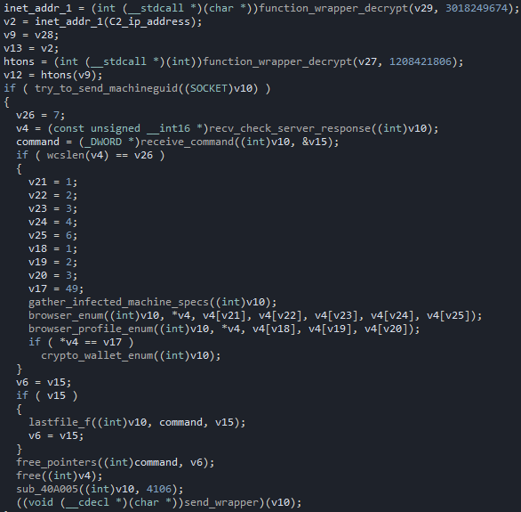
> *Figure 7: Main function*


 **Analyst Note:** Although this sample doesn't have any anti-virtualization or anti-debug countermeasures, the builder allows customers to add these functionalities. Therefore, samples may not reveal some of the features which are based on the malware build configuration.


Before making the first connection to the command and control server, malware creates a machine identifier based on the following registry value:
`SOFTWARE\Microsoft\Cryptography\MachineGuid`

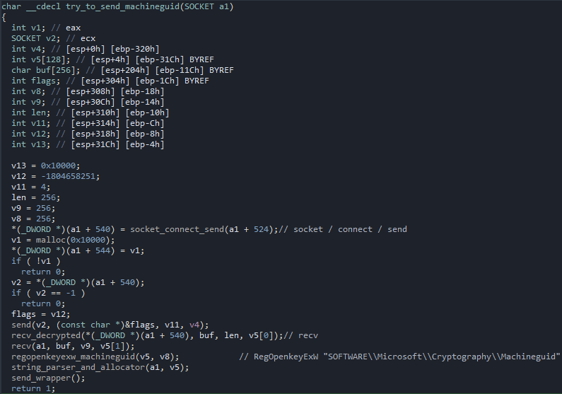
> *Figure 8: Creation of machine identifier*



**Analyst Note:** To be noted, functions in the image are renamed during analysis to provide insight about capabilities of the functions, names are not available in the sample itself.


After creating the machine identifier, malware collects system specifics. The following information is collected from the system:

* Username


* Computer name


* Display devices


* CPU model


* Number of processors


* System metrics


* Windows product name


* Sample file name


* System language


* Available memory space


* Keyboard layout list


* System locale


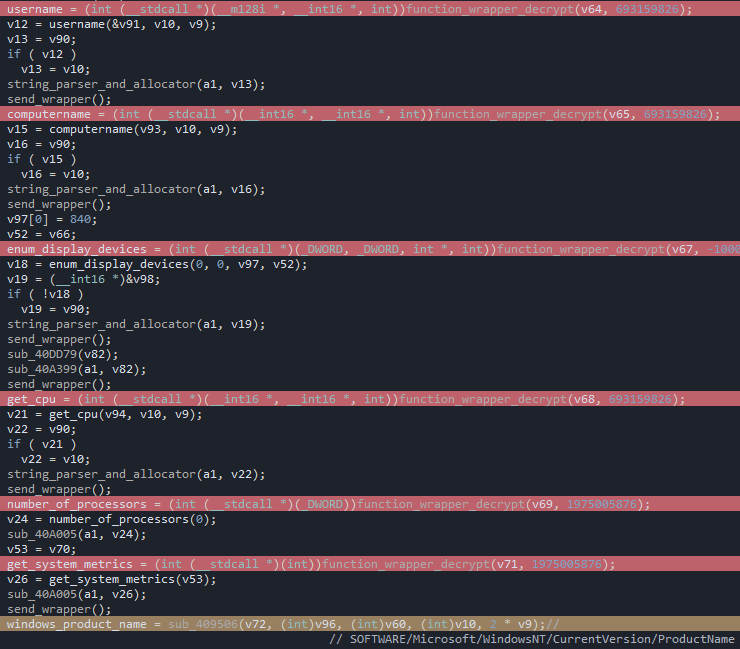
> *Figure 9: Gathered system specifications*


### 3.3 Stealing Capabilities

#### 3.3.1 Browser Hijacking

Mystic stealer can steal browser logins, cookies, saved credit cards, history, and information stored by extensions.

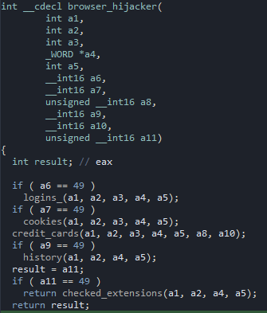
> *Figure 10: Stolen browser information*


Decoded identifiers of targeted browser extensions are provided in the debugger memory dump.

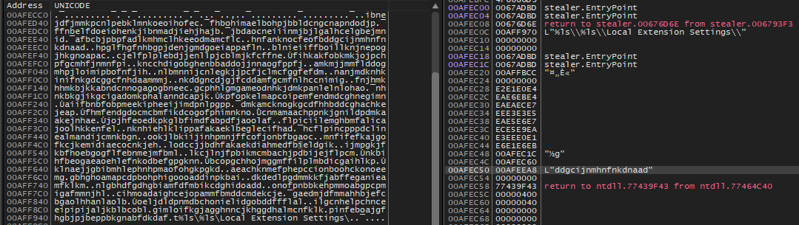
> *Figure 11: Checked browser extensions*

Targeted cryptocurrency wallets and 2FA extensions include:

* **TronLink** (`ibnejdfjmmkpcnlpebklmnkoeoihofec`)


* **BinanceChain** (`fhbohimaelbohpjbb1dcngcnapndodjp`)


* **Yoroi** (`ffnbelfdoeiohenkjibnmadjiehjhajb`)


* **Nifty Wallet** (`jbdaocneiiinmjbjlgalhcelgbejmnid`)


* **Math Wallet** (`afbcbjpbpfadlkmhmclhkeeodmamcflc`)


* **Coinbase Wallet** (`hnfanknocfeofbddgcijnmhnfnkdnaad`)


* **Guarda** (`hpgIfhgfnhbgpjdenjgmdgoeiappafin`)


* **EQUAL Wallet** (`blnieiiffboillknjnepogjhkgnoapac`)


* **Jaxx Liberty** (`cjelfplplebdjjenllpjcblmjkfcffne`)


* **BitApp Wallet** (`fihkakfobkmkjojpchpfgcmhfjnmnfpi`)


* **iWallet** (`kncchdigobghenbbaddojjnnaogfppfj`)


* **Wombat** (`amkmjjmmflddogmhpjloimipbofnfjih`)


* **MEW CX** (`nlbmnnijcnlegkjjpcfjclmcfggfefdm`)


* **Guild Wallet** (`nanjmdknhkinifnkgdcggcfnhdaammmj`)


* **Saturn Wallet** (`nkddgncdjgjfcddamfgcmfnlhccnimig`)


* **Ronin Wallet** (`fnjhmkhhmkbjkkabndcnnogagogbneec`)


* **NeoLine** (`cphhlgmgameodnhkjdmkpanlelnlohao`)


* **Clover Wallet** (`nhnkbkgjikgcigadomkphalanndcapjk`)


* **Liquality Wallet** (`kpfopkelmapcoipemfendmdcghnegimn`)


* **Terra Station** (`aiifbnbfobpmeekipheeijimdpnlpgpp`)


* **Keplr** (`dmkamcknogkgcdfhhbddcghachkejeap`)


* **Sollet** (`fhmfendgdocmcbmfikdcogofphimnkno`)


* **Auro Wallet** (`cnmamaachppnkjgnildpdmkaakejnhae`)


* **Polymesh Wallet** (`jojhfeoedkpkglbfimdfabpdfjaoolaf`)


* **ICONex** (`flpiciilemghbmfalicajoolhkkenfel`)


* **Nabox Wallet** (`nknhiehlklippafakaeklbeglecifhad`)


* **KHC** (`hcflpincpppdclinealmandijcmnkbgn`)


* **Temple** (`ookjlbkiijinhpmnjffcofjonbfbgaoc`)


* **TezBox** (`mnfifefkajgofkcjkemidiaecocnkjeh`)


* **DAppPlay** (`lodccjjbdhfakaekdiahmedfbieldgik`)


* **BitClip** (`Ijmpgkjfkbfhoebgogflfebnmejmfbml`)


* **Steem Keychain** (`Ikcjlnjfpbikmcmbachjpdbijejflpcm`)


* **MetaMask** (`nkbihfbeogaeaoehlefnkodbefgpgknn`)


* **Hycon Lite Client** (`bcopgchhojmggmffilplmbdicgaihlkp`)


* **ZilPay** (`klnaejjgbibmhlephnhpmaofohgkpgkd`)


* **Coin98 Wallet** (`aeachknmefphepccionboohckonoeemg`)


* **Authenticator** (`bhghoamapcdpbohphigoooaddinpkbai`)


* **Cyano Wallet** (`dkdedlpgdmmkkfjabffeganieamfklkm`)


* **Byone** (`nlgbhdfgdhgbiamfdfmbikcdghidoadd`)


* **Nash Extension** (`onofpnbbkehpmmoabgpcpmigafmmnjhl`)


* **Leaf Wallet** (`cihmoadaighcejopammfbmddcmdekcje`)


* **Authy 2FA** (`gaedmjdfmmahhbjefcbgaolhhanlaolb`)


* **EOS Authenticator** (`oeljdldpnmdbchonielidgobddffflal`)


* **GAuth Authenticator** (`ilgcnhelpchnceeipipijaljkblbcobl`)


* **Trezor Password Manager** (`imloifkgjagghnncjkhggdhalmcnfklk`)


* **OneKey** (`infeboajgfhgbjpjbeppbkgnabfdkdaf`)


* **EVER Wallet** (`cgeeodpfagjceefieflmdfphplkenifk`)


* **KardiaChain Wallet** (`pdadjkfkgcafgbceimcpbkalnfnepbnk`)


* **Rabby Wallet** (`acmacodkjbdgmoleebolmdjonilkdbch`)


* **Phantom** (`bfnaelmomeimhlpmgjnjophhpkkoljpa`)


* **Oxygen – Atomic Crypto Wallet** (`fhilaheimglignddkjgofkcbgekhenbh`)


* **Pali Wallet** (`mgffkfbidihjpoaomajlbgchddlicgpn`)


* **XDEFI Wallet** (`hmeobnfnfcmdkdcmlblgagmfpfboieaf`)


* **Nami** (`Ipfcbjknijeeillifnkikgncikgfhdo`)


* **MultiversX DeFi Wallet** (`dngmlblcodfobpdpecaadgfbcggfjfnm`)


* **Solflare Wallet** (`bhhhlbepdkbapadjdnnojkbgioiodbic`)


* **Goby** (`jnkelfanjkeadonecabehalmbgpfodjm`)


* **SteemKeychain** (`jhgnbkkipaallpehbohjmkbjofjdmeid`)


* **Braavos Smart Wallet** (`jnlgamecbpmbajjfhmmmlhejkemejdma`)


* **Enkrypt** (`kkpllkodjeloidieedojogacfhpaihoh`)


* **OKX Wallet** (`mcohilncbfahbmgdjkbpemcciiolgcge`)


* **Hashpack** (`gjagmgiddbbciopjhllkdnddhcglnemk`)


* **Eternl** (`kmhcihpebfmpgmihbkipmjlmmioameka`)


* **Pontem Aptos Wallet** (`phkbamefinggmakgklpkljjmgibohnba`)


* **Keeper Wallet** (`Ipilbniiabackdjcionkobglmddfbcjo`)


* **Finnie** (`cjmkndjhnagcfbpiemnkdpomccnjblmj`)


* **Leap Terra Wallet** (`aijcbedoijmgnlmjeegjaglmepbmpkpi`)


* **Dashlane Password Manager** (`fdjamakpfbbddfjaooikfcpapjohcfmg`)


* **NordPass Password Manager** (`fooolghllnmhmmndgjiamiiodkpenpbb`)


* **RoboForm Password Manager** (`pnlccmojcmeohlpggmfnbbiapkmbliob`)


* **LastPass** (`hdokiejnpimakedhajhdIcegeplioahd`)


* **Browserpass** (`naepdomgkenhinolocfifgehidddafch`)


* **MYKI Password Manager & Authenticator** (`bmikpgodpkclnkgmnpphehdgcimmided`)


* **Martian Wallet for Sui & Aptos** (`efbglgofoippbgcjepnhiblaibcnclgk`)


Browser paths checked by Mystic Stealer include Google Chrome, Microsoft Edge, Chromium, Opera, Yandex, Brave, Vivaldi, and many derivative or niche browsers.

| Opera | Comodo | Uran | Torch |
| --- | --- | --- | --- |
| Liebao | Kometa | Chedot | Iridium |
| Vivaldi | Orbitum | K-Melon | Chromium |
| QIP Surf | Maxthon3 | Nichrome | Chromodo |
| Amigo | 7Star | CentBrowser | Mail.Ru |
| Chrome | Coowon | Edge | CozMedia |
| CocCoc | Sputnik | Elements Browser | Chrome(32-bit) |
| 360 Browser | Epic Privacy | Catalina Group | Yandex |
| Chrome Plus | Brave | Sleipnir5 | IceCat |
| Firefox | Cyberfox | Blackhawk | Falkon |

#### 3.3.2 Cold Wallets

Targeted cold cryptocurrency wallets include:

* Monero
* Exodus
* Binance
* Raven
* atomic_qt
* Armory
* Dogecoin
* MultiBit
* DashCore
* Electrum
* LiteCoin
* BitcoinGold
* Wasabi Wallet
* Guarda
* Electrum-LTC
* MyCrypto
* Bisq/btc_mainnet
* DeFi blockchain
* Coinomi
* TokePocket
* com.liberty.jaxx


#### 3.3.3 Checked Banking Domains

Various domains checked in browser logins include:

* `online.canarabank.in`
* `ms.portal.azure.com`
* `dev.azure.com`
* `outlook.office365.com`
* `tasks.office.com`
* `autofill.account.microsoft.com`
* `turbotax.intuit.com`
* `bankofamerica.com`
* `secure.bankofamerica.com`


### 3.4 Command and Control Communication

Mystic Stealer sends the hexadecimal value `0x946F19B5` to initialize TCP server communication.

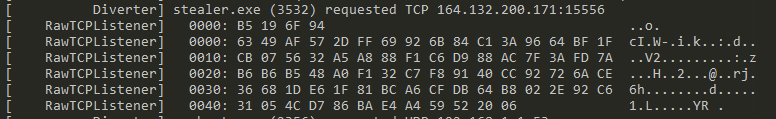
> *Figure 13: Package prefix*


Mystic Stealer sends information after every enumeration function instead of creating a log file in the system. Since it communicates with the server while performing its checks, it creates a lot of noise in the network which makes its detection easier on the system.

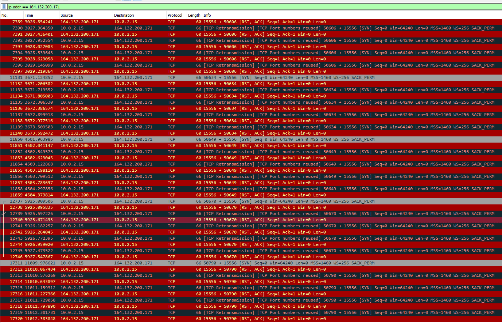
> *Figure 14: Network communication made by sample*


---

## 5. YARA Rule

```yara
rule mystic_stealer_v1{
    meta:
        author = "@batcain_"
        date = "10.07.2023"
    strings:
        $hex4 = {FF B4 24 ?? OF 00 00 8B CA 8D 84 24 ?? 01 00 00 FF B4 24 ?? OF 00 00 C1 E9 02 FF B4 24 ?? OF 00 00 F3 A5 FF B4 24 ?? OF 00 00 8B CA FF B4 24 ?? OF 00 00 83 E1 03 FF B4 24 ?? OF 00 00 F3 A4 55 50 53 53 FF B4 24 ?? OF 00 00 E8 ???? 00 00}
    condition:
        all of them and filesize <300KB
}

```

---

## 6. MITRE ATT&CK Threat Matrix

1. **TA0002 Execution**

* **T1204 User Execution**

* **T1204.002 Malicious File**


2. **TA0005 Defense Evasion**

* **T1140 Deobfuscate/Decode Files or Information**


3. **TA0006 Credential Access**

* **T1555 Credentials from Password Stores**

* **T1555.003 Credentials from Web Browsers**

* **T1555.005 Password Managers**


* **T1539 Steal Web Session Cookie**


4. **TA0007 Discovery**

* **T1082 System Information Discovery**

* **T1033 System Owner/User Discovery**


5. **TA0009 Collection**

* **T1005 Data From Local System**


6. **TA0011 Command and Control**

* **T1573 Encrypted Channel**

* **T1573.001 Symmetric Cryptography**


7. **TA0010 Exfiltration**

* **T1041 Exfiltration Over C2 Channel**


---

## 7. IOC Table

### Sample C2

* `164.132.200.171`


### V1.2 Panels

* `lib.sultanolama.com`

* `byggmastarn.nu`

* `s3.my-servers.us`

* `byggmastarniskane.se`

* `marisolblooms.com`

* `45.9.74.110`

* `95.216.32.74`

* `94.130.164.47`


### V2 Panels

* `109.248.206.137`

* `116.202.233.49`

* `137.206.248.109`

* `142.132.201.228`

* `142.93.11.96`

* `167.235.34.144`

* `188.40.116.251`

* `193.233.48.167`

* `212.113.106.114`

* `34.88.245.41`

* `5.188.87.45`

* `5.196.93.222`

* `5.42.94.125`

* `5.75.183.169`

* `64.52.80.55`

* `89.23.107.241`

* `91.121.118.80`

* `94.130.164.47`

* `94.130.165.48`

* `94.130.216.165`

* `95.216.32.74`


### Other Mystic Stealer Sample Hashes

* `47439044a81b96be0bb34e544da881a393a30f0272616f52f54405b4bf288c7c`

* `39d3532ffb7565aa79bd6ae6f510ecc7ac29ed7cd0a98a7b948c10162c5c25c0`

* `8eebef1167ba58681276502fdba907ce5f63d5bbbf68b887b2cc1b2dd4bbc177`

* `4c5bbf836913bccd7d8a18ea3ac742057b14fc739b05502e74d389e36fa829bb`